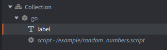

In this example you'll learn how to generate pseudo-random numbers in Defold using built-in math API.

In the example there is only a game object containing:
- *Label* component where we show the text information
- *Script* component where we generate random numbers

Script sets the built-in random generator with a value of os.time() - which should be different every time you run it.
Then produces 3 random numbers using math.random().

For more details refer to Defold API: [https://defold.com/ref/stable/math-lua/#math.random:m-n](https://defold.com/ref/stable/math-lua/#math.random:m-n)