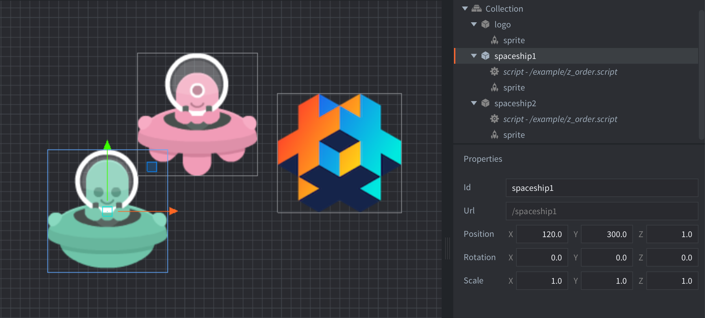

There is one game object containing the logo sprite. It is set at Z position 0.
The green spaceship is another game object containing a sprite. It is set at Z position 0.5.
The pink spaceship is another game object containing a sprite. It is set at Z position -0.5.
