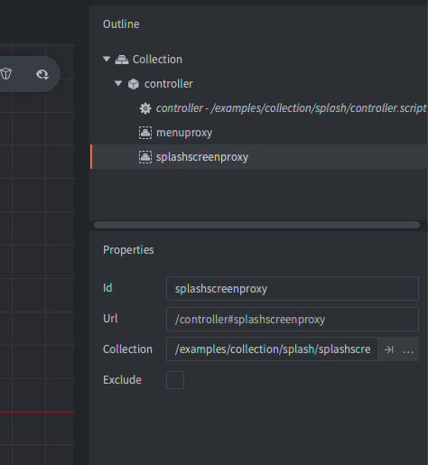
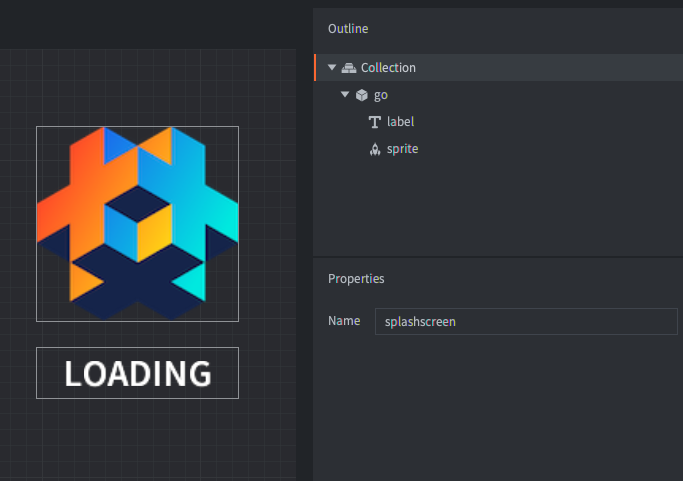

The setup consists of several collections and game objects.

splash.collection
: This is the bootstrap collection specified in `game.project`. Contains:
  - A *Script* that handles loading and unloading of collection proxies
  - Two *Collection proxies* referencing the splash screen and a menu collection.

menu.collection
: This collection contains a menu. Contains:
  - A *GUI* with some box and text nodes that acts as buttons.

splashscreen.collection
: Collections representing the splash screen.
