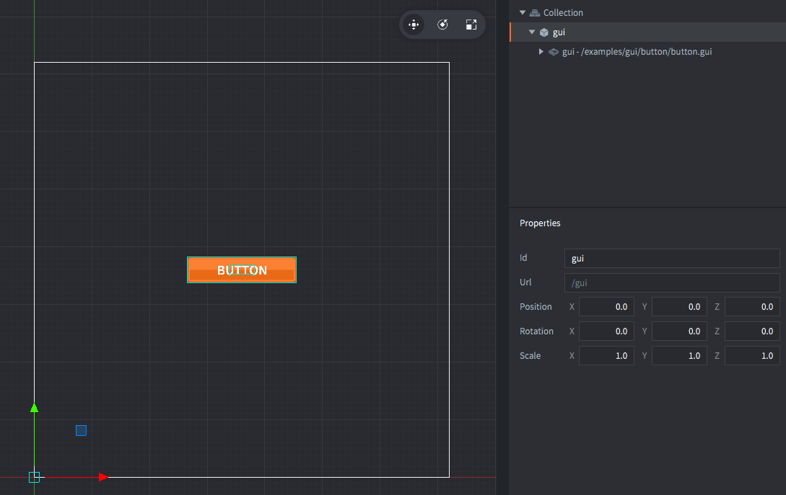
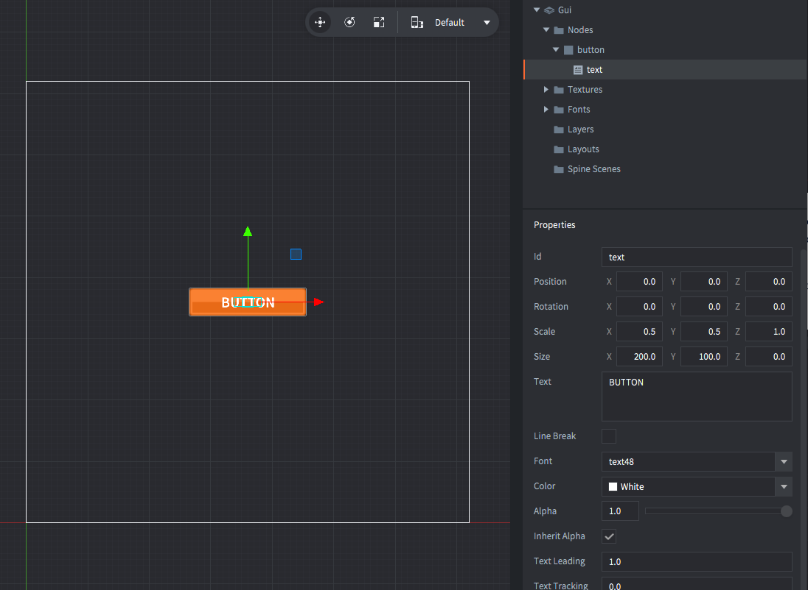

The "gui" game object contains a GUI component stored in the file *button.gui*. The GUI contains
the setup with the "button" box node for the button image and the "text" text node for the button label text.

*button.gui* has a script attached to it, called *button.gui_script*, which contains the button logic.

