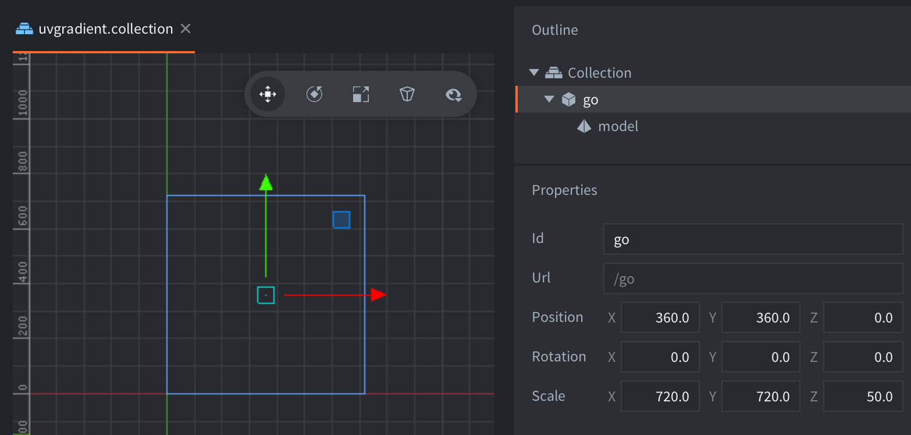

This example contains a game object with a model component. The model component uses the `/builtins/assets/meshes/quad.gltf` mesh, which is a rectangle 1 by 1 unit large. The game object is scaled to the dimensions of the screen so that the mesh covers the entire screen.

The shader is very basic and sets the fragment color based on the UV position, thus creating a color gradient. This is a good starting point when experimenting with graphical effects using a shader.
