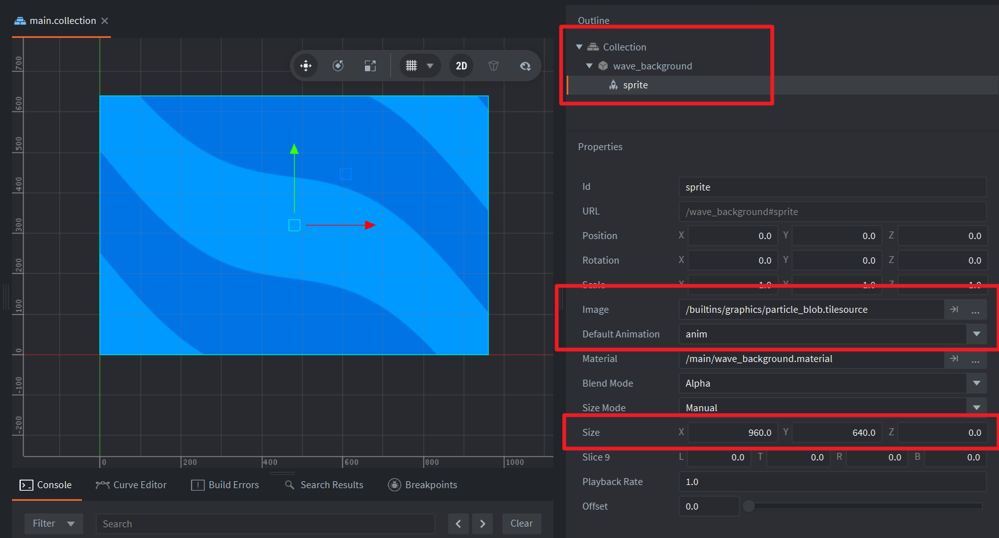

This example contains a game object with a sprite component. The `Image` and `Default Animation properties` of the sprite component cannot be left empty, otherwise an error will occur. In the example the built-in `/builtins/graphics/particle_blob.tilesource` is used and animation is set to `anim`. You can adjust the size of the wave background by modifying the `Size` property of the sprite component.

Example uses a Fragment Constant of type `Time` introduced in Defold 1.12.3.

