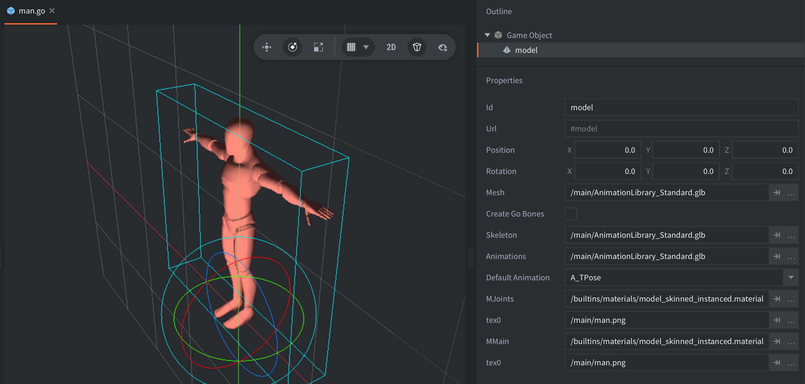

This example shows how the `model_skinned_instanced.material` is used to render and animate many instances of the same model efficiently using instancing and GPU skinning.

Model from the [Universal Animation Library](https://quaternius.itch.io/universal-animation-library).