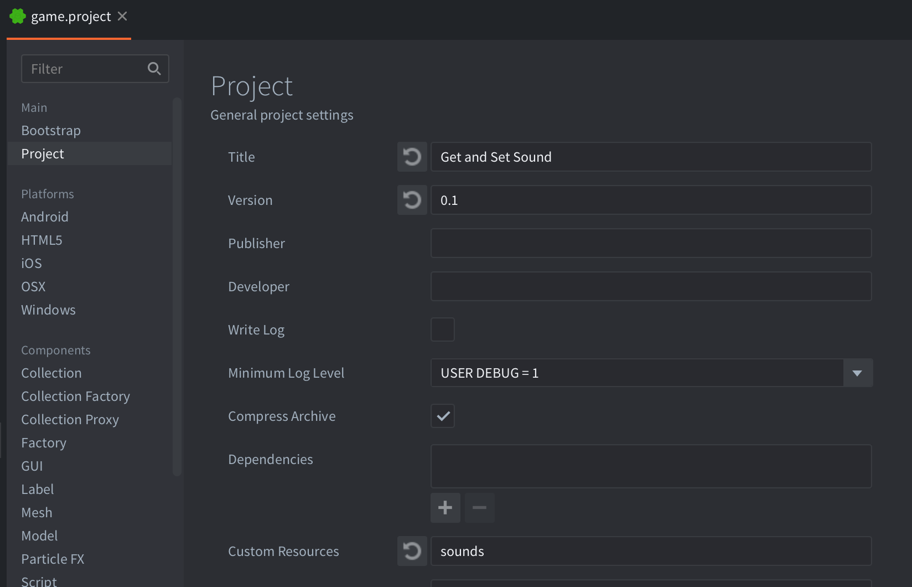
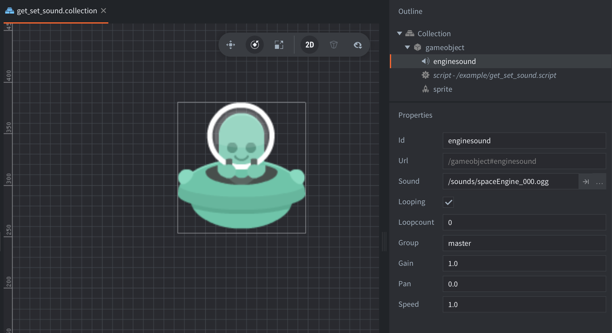

This example shows how to change which sound a sound component plays. Additional sounds are stored as individual .ogg files in the `sounds` folder and included in the build as [Custom Resources](https://defold.com/manuals/file-access/#custom-resources):

The example consists of a single collection with a game object containing a Sound component, a Sprite component for visuals and a Script to control the logic:

Sound effects and space ship by [Kenney](https://www.kenney.nl)