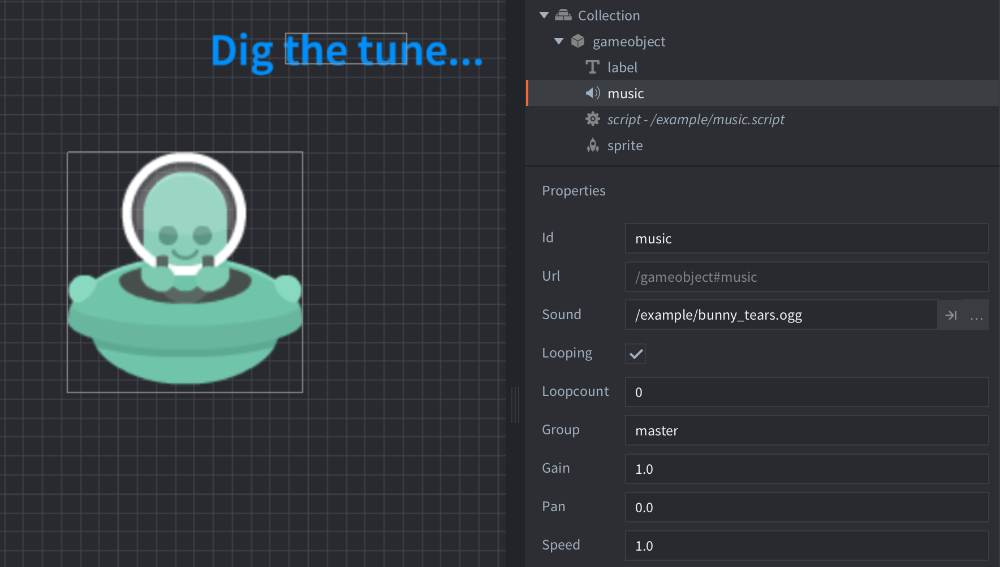

---
author_ids:
- defold-foundation
brief: This example shows how to play a piece of music, stored as an .OGG file, with a sound component. The sound component is set to "looping" causing the music to never, ever stop.
category: sound
layout: example
opengraph_image: https://www.defold.com/examples/sound/music/music.png
path: sound/music
scripts: music.script
tags: sound
thumbnail: music.png
title: Music
twitter_image: https://www.defold.com/examples/sound/music/music.png

---

