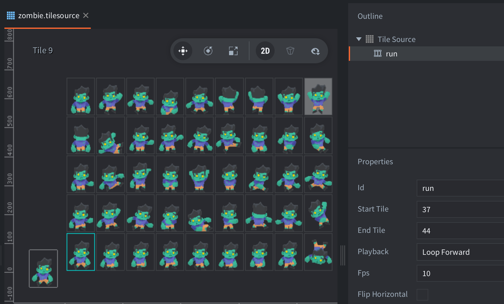

The example shows a game object with a sprite and a script with three script properties to reference different tilesource images. The script lets the user change which image to use on the sprite.

It is also possible to use a script property to reference an atlas instead of a tilesource:

```lua
go.property("hero", resource.atlas("/assets/hero.atlas"))

function init(self)
	go.set("#sprite", "image", self.hero)
end
```


