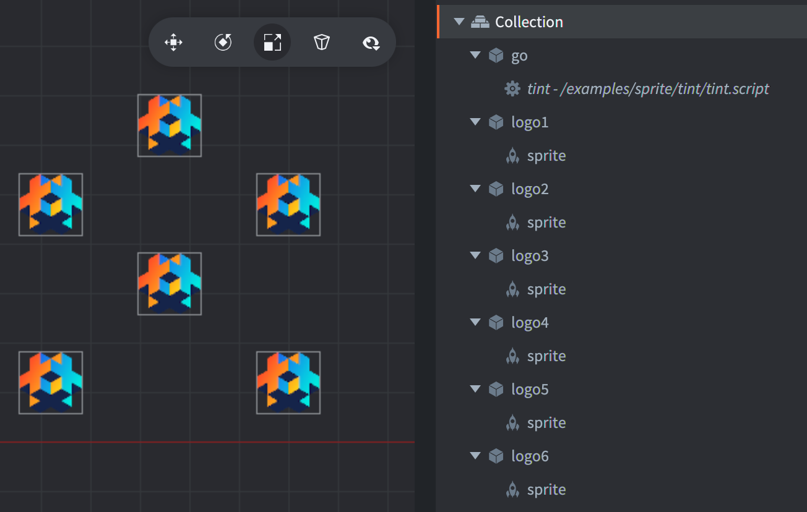
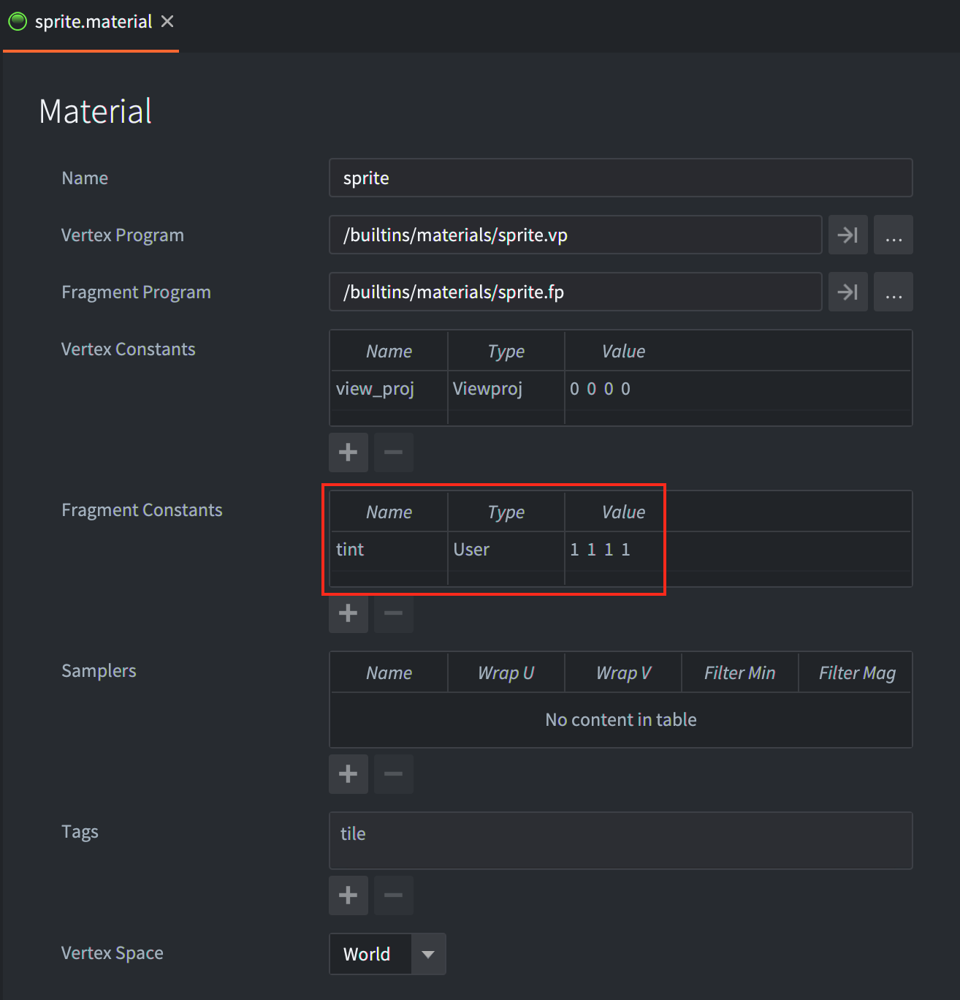

The example uses a script to tint (color) sprites in a couple of different ways. The tint is a fragment constant on the sprite material and it is used in the sprite.fp fragment shader program to modify the color sampled from the texture.

It is important to keep in mind that each tinted sprite generates a new draw call since a modified tint value will break the built in draw call batching in Defold.

