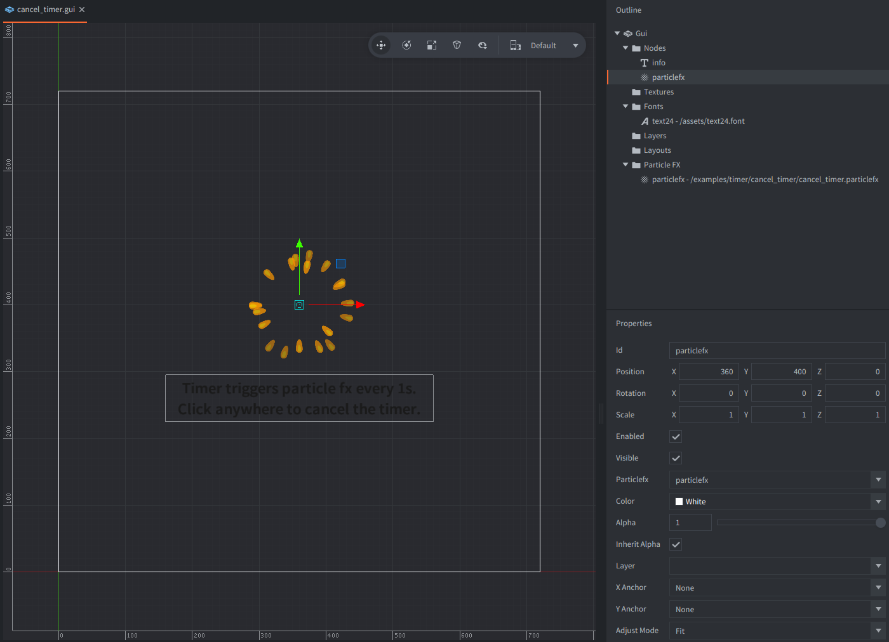

The example shows how to use Defold built-in timer and uses two indicators:

1. A particlefx gui node that is triggered every 1s.
2. A text node with an information displaying.

The particle fx is played every 1s showing small eruption.
You can click anywhere to cancel the timer and the particlefx won't be triggered anymore.

