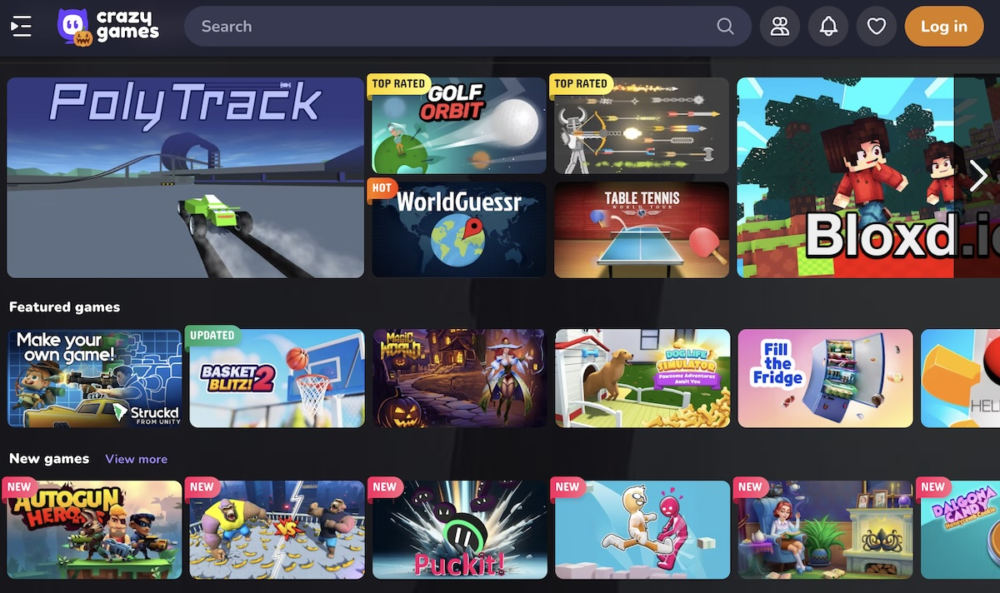

# Defold CrazyGames SDK extension API documentation

This extension provides a CrazyGames SDK integration for Defold. [CrazyGames](https://www.crazygames.com/) is a popular browser games platform. Submit your own games via [developer.crazygames.com](https://developer.crazygames.com/).




# Installation
To use CrazyGames SDK in your Defold project, add a version of the CrazyGames SDK extension to your `game.project` dependencies from the list of available [Releases](https://github.com/defold/extension-crazygames/releases). Find the version you want, copy the URL to ZIP archive of the release and add it to the project dependencies.


Select `Project->Fetch Libraries` once you have added the version to `game.project` to download the version and make it available in your project.

# Usage


## Implement the gameplay events

Use the `crazygames.gameplay_start()` event to describe when users are playing your game (e.g. on first user interaction and unpause).

Use the `crazygames.gameplay_stop()` event to describe when users aren’t playing your game (e.g. level finish, game over, pause, quit to menu).

```lua
-- first level loads, player clicks anywhere
crazygames.gameplay_start()
-- player is playing
-- player loses round
crazygames.gameplay_stop()
-- game over screen pops up
```

[Link to official documentation](https://docs.crazygames.com/sdk/html5-v3/game/#gameplay-startstop)


## Implement loading events

Use the `crazygames.loading_start()` and `crazygames.loading_stop()` events to track when and how long the loading of your game takes.

```lua
-- assets are loading
crazygames.loading_start()
-- assets are loaded
crazygames.loading_stop()
```

[Link to official documentation](https://docs.crazygames.com/sdk/html5-v3/game/#game-loading-startstop)


## Implement midgame ads

Midgame advertisements can happen when a user died, a level has been completed, etc. Do not show a midgame ad on a navigational button (e.g. when clicking the main menu icon or opening the settings or opening the shop). [Learn more about the requirements for midgame ads on the official CrazyGames developer pages](https://docs.crazygames.com/requirements/ads/#requirements-for-midgame-ads).


```lua
crazygames.show_midgame_ad(function(self, result)
  if result then
    print("Midgame ad was successfully shown")
  else
    print("Request for midgame ad was unfilled")
  end
end)
```

[Link to official documentation](https://docs.crazygames.com/sdk/html5-v3/video-ads/#video-ads_1)


## Implement rewarded ads

Rewarded advertisements can be requested by the user in exchange for a reward (An additional life, a retry when the user died, a bonus starting item, extra starting health, etc.). Rewarded ads should be shown when users explicitly consent to watch an advertisement. [Learn more about the requirements for rewarded ads on the official CrazyGames developer pages](https://docs.crazygames.com/requirements/ads/#requirements-for-rewarded-ads).


```lua
crazygames.show_rewarded_ad(function(self, result)
  if result then
    print("Rewarded ad was successfully shown")
  else
    print("Rewarded ad was not shown due to an error")
  end
end)
```

[Link to official documentation](https://docs.crazygames.com/sdk/html5-v3/video-ads/#video-ads_1)


## Happy time

The `crazygames.happytime()` method can be called on various player achievements (beating a boss, reaching a highscore, etc.). It makes the website celebrate (for example by launching some confetti). There is no need to call this when a level is completed, or an item is obtained.

```lua
crazygames.happytime()
```

[Link to official documentation](https://docs.crazygames.com/sdk/html5-v3/game/#happy-time)


## Invite button

This feature allows you to display a button in the game footer, that opens a popup containing the invite link. The link can be used to share the CrazyGames version of your game to the players and invite them to join a multiplayer game.

```lua
crazygames.show_invite_button({
  roomId = 12345,
  param1 = "value1",
  param2 = true,
})
```

[Link to official documentation](https://docs.crazygames.com/sdk/html5-v3/game/#invite-button)


## Invite button

This feature lets you share the CrazyGames version of your game to the players and invite them to join a multiplayer game.

```lua
local link = crazygames.invite_link({
  roomId = 12345,
  param1 = "value1",
  param2 = true,
})
```

[Link to official documentation](https://docs.crazygames.com/sdk/html5-v3/game/#invite-link)


## Example

[Refer to the example project](https://github.com/defold/extension-crazygames/blob/master/main/crazygames.gui_script) to see a complete example of how the intergation works.


## Source code

The source code is available on [GitHub](https://github.com/defold/extension-crazygames)


## API reference
[API Reference - crazygames](/extension-crazygames/crazygames_api)
