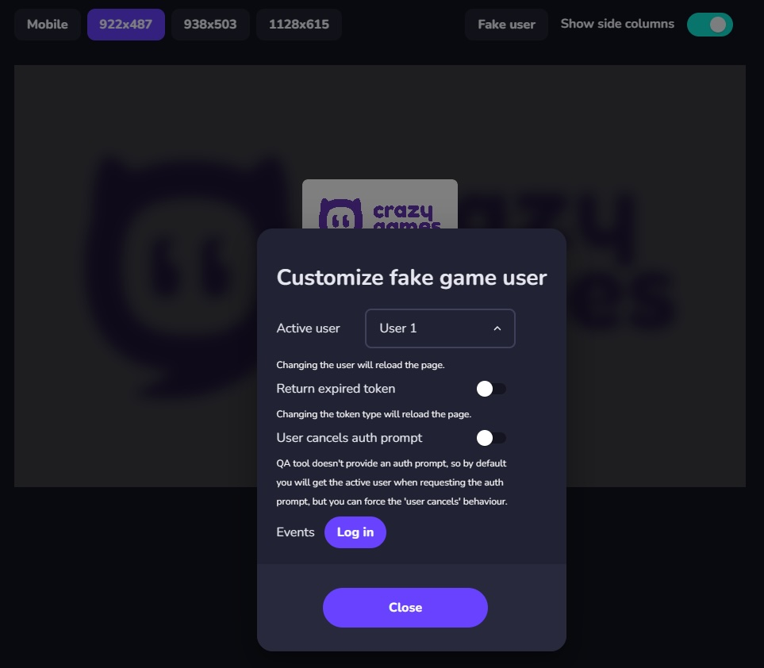

# User

The user module provides various account functionality that you can use to authenticate a user in your game. This means that the CrazyGames players who are logged in on the platform will be able to play games that require a user account without having to register in the game. They will also be logged in automatically in the game on other devices where they use the same CrazyGames account.

The [account integration](https://docs.crazygames.com/requirements/account-integration/) page already familiarized you with the possible SDK scenarios. For the scenarios where authentication is available, please consult the appropriate link below.


## Check availability

The user account functionality is not available on other domains that embed your CrazyGames game. Before using any user account features, you should always ensure that the user account system is available.

```lua
local available = crazygames.is_user_account_available()
print("User account system available", available);
```


### Auth listener

You can register user auth listeners that are triggered when the player logs in CrazyGames. A log out doesn't trigger the auth listeners, since the entire page is refreshed when the player logs out

```lua
crazygames.set_auth_listener(function(self, user)
  -- handle user
end)

crazygames.remove_auth_listener()
```

After detecting a login using the Auth Listener, if you use the CrazyGames account as an identifier you should fetch the user's progress from your back-end.

If you rely on the [data module](data) or [automatic progress save](https://docs.crazygames.com/other/aps/), CrazyGames' system automatically reloads the game in case of a login.


## Get current user

You can retrieve the user currently logged in CrazyGames with the following method:

```lua
crazygames.get_user(function(self, user)
  print(user.username, user.profilePictureUrl)
end)
```

If the user is not logged in CrazyGames, the returned user will be nil.

The returned user object will look like this:

```json
{
    "username": "SingingCheese.TLNU",
    "profilePictureUrl": "https://images.crazygames.com/userportal/avatars/4.png"
}
```


### Auth prompt

By calling this method, the log in or register popup will be displayed on CrazyGames. The user can log in their existing account, or create a new account.

```lua
crazygames.show_auth_prompt(function(self, user)
  print(user.username, user.profilePictureUrl)
end)
```


### Get user token

The user token contains the userId of the player that is currently logged in CrazyGames, as well as other useful information (username, profilePictureUrl, etc). You should send it to your server when required, and verify/decode it there to extract the userId. This is useful for linking the user accounts for example, where you can have a column "crazyGamesId" in your user table that will be populated with the user id from the token.

```lua
crazygames.get_user_token(function(self, token)
  print(token)
end)
```

The token has a lifetime of 1 hour. The method will handle the token refresh. We recommend that you don't store the token, and always call this method when the token is required.


The returned token can be decoded for testing purposes on [jwt.io](https://jwt.io/).

The token payload will contain the following data:

```json
{
    "userId": "UOuZBKgjwpY9k4TSBB2NPugbsHD3",
    "gameId": "20267",
    "username": "RustyCake.ZU9H",
    "profilePictureUrl": "https://images.crazygames.com/userportal/avatars/16.png",
    "iat": 1670328680,
    "exp": 1670332280
}
```

When you need to authenticate the requests with your server, you should send the token together with the requests.

The token can be verified with the public key hosted at this URL [https://sdk.crazygames.com/publicKey.json](https://sdk.crazygames.com/publicKey.json). We recommend that you fetch the key every time you verify the token, since it may change. Alternatively, you can implement a caching mechanism, and re-fetch it when the token fails to decode due to a possible key change.


## Testing

### Local
When the SDK is in the local environment (on 127.0.0.1 or localhost) it will return some hardcoded default values for the method calls in the user module.

You can customize the returned local values by appending these query parameters:

* `?user_account_available=false` will change the response from the `is_user_account_available()` function to false (it returns true by default).
* `?show_auth_prompt_response=` will change the response from the `show_auth_prompt()` function. It accepts the following values: `user1`, `user2`, `user_cancelled`
* `?link_account_response=` will change the response from the `show_account_link_prompt()` method. It accepts the following values: `yes`, `no`, `logged_out`
* `?user_response=` will change the response from the `get_user()` function. It accepts the following values: `user1`, `user2`, `logged_out`
* `?token_response=` will change the response from the `get_user_token` function. It accepts the following values: `user1`, `user2`, `expired_token` (to return an expired token), `logged_out`

By default, `get_user` returns `user1`, `get_user_token` returns token for `user1`, `show_account_link_prompt` returns `yes`, `show_auth_prompt` returns `user1`, and `is_user_account_available` returns `true`.


### QA Tool
When previewing the game in the QA tool, you can customize the user module behavior with the following modal:


