# FMOD for Defold

_FMOD_ is a cross-platform audio engine by Firelight Technologies with real-time mixing, adaptive music, 3D spatial audio, and runtime parameter control. Sound events are authored in the [Studio](https://www.fmod.com/studio) application and exported as bank files that the engine loads at runtime.

This extension wraps both the Studio and Core APIs for Lua, giving access to the event system, buses, banks, and low-level channel control directly from Defold scripts. It is particularly useful for projects that need dynamic audio beyond simple play/stop, such as vehicle engines that respond to RPM, ambient environments that shift with game state, or music that crossfades between layers based on player action.

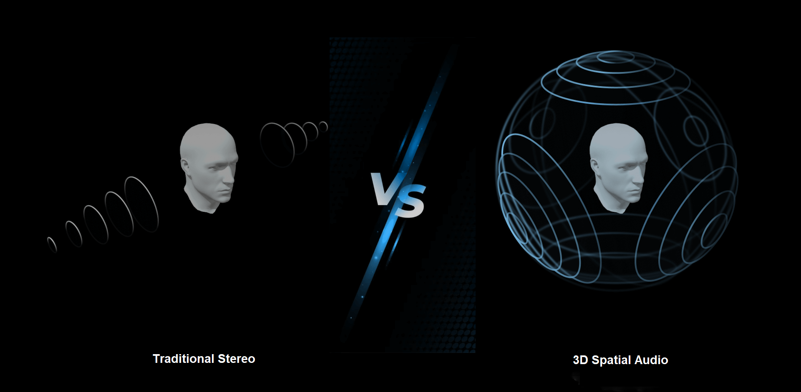

*(Source: [Agora.io](https://docs.agora.io/en/video-calling/advanced-features/spatial-audio))*

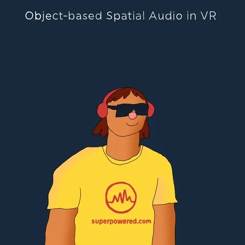


## Requirements

- Defold 1.11.x or newer
- [FMOD Studio](https://www.fmod.com/download) to author events and export banks

### Licensing

Commercial usage of FMOD requires a license from Firelight Technologies. All products require an in-game credit line including "FMOD" and "Firelight Technologies Pty Ltd", plus the FMOD logo. See [fmod.com/legal](https://fmod.com/legal) and [fmod.com/licensing](https://fmod.com/licensing).

### Installation

To use FMOD in your Defold project, add the extension URL to your `game.project` dependencies from [Releases](https://github.com/defold/extension-fmod/releases). Copy the URL of the ZIP archive for the version you want and add it to the project dependencies   

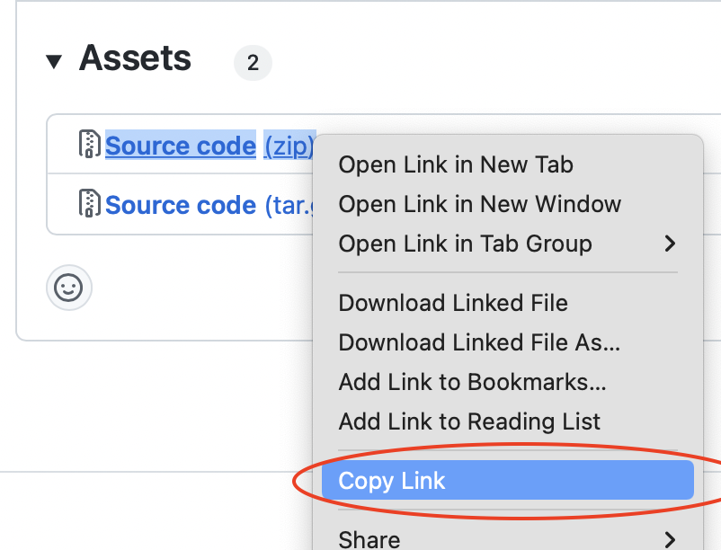

Select <kbd>Project ▸ Fetch Libraries</kbd> to download the extension and make it available in your project.

## Getting started

### Preparing audio in FMOD Studio

You'll need content from FMOD Studio. In Studio you can create **events**, which are sound definitions that can have multiple layers, randomisation, effects, and parameter-driven behaviour. Events live inside **banks**, which are the compiled files your game loads at runtime.


A typical starting workflow:

1. Create or open project in FMOD Studio

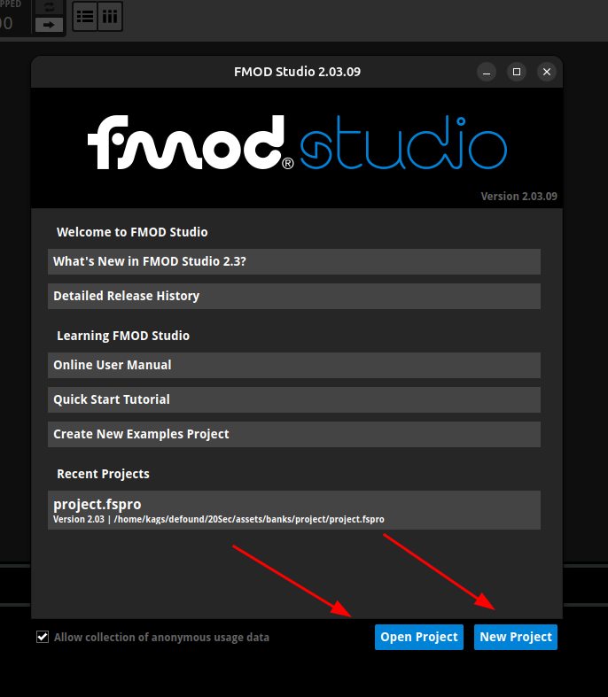

2. Import assets via right-click in the **Assets** tab

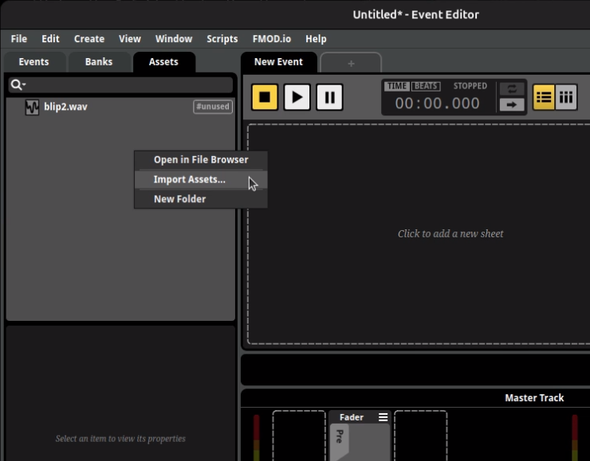

3. Create events from assets by right-clicking an asset and selecting **Create Event**. An event wraps one or more audio files with playback logic, effects, and parameter automation.

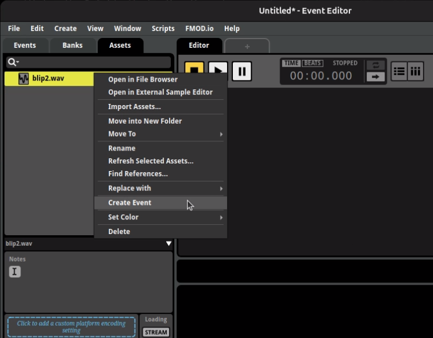

4. Assign a bank to those events via right-click on the **Events** tab. Banks group events for loading at runtime; the default Master bank works to start with.

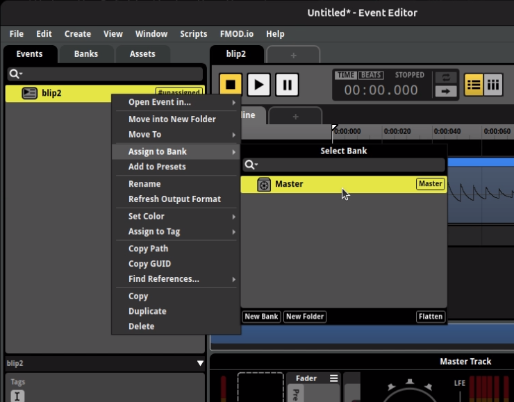

5. Build the project via <kbd>File ▸ Build</kbd> to produce `.bank` files

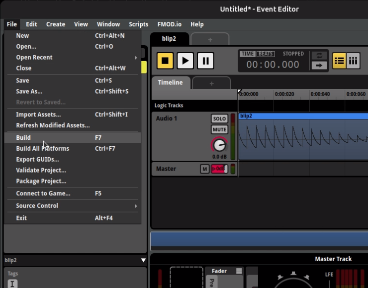


Every build produces at least a **Master Bank** and a **Master Bank.strings** bank. The master bank holds global mixer and bus data, while the strings bank maps event paths (like `event:/UI/Click`) to their internal IDs.

### Project setup

1. Place your exported `.bank` files in your project and add the directory to `custom_resources` in `game.project` (this makes banks available via `resource.load()` during development; for release builds, see [Loading banks from the file system](#loading-banks-from-the-file-system))
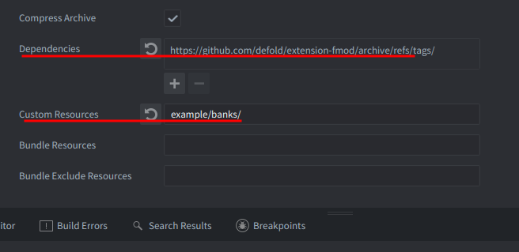

2. You always need at least two banks: the **Master Bank** and the **Master Bank.strings** bank
3. Check that FMOD is available on your platform before calling any API:

```lua
if not fmod then
  return
end
```

### Playing your first sound

The extension initialises the FMOD system automatically, so `fmod.studio.system` is ready by the time your script's `init()` runs. Load banks, then create and start an event instance:

```lua
function init(self)
  if not fmod then return end

  fmod.studio.system:load_bank_memory(resource.load("/banks/Master Bank.bank"), fmod.STUDIO_LOAD_BANK_NORMAL)
  fmod.studio.system:load_bank_memory(resource.load("/banks/Master Bank.strings.bank"), fmod.STUDIO_LOAD_BANK_NORMAL)

  fmod.studio.system:get_event("event:/UI/Click"):create_instance():start()
end
```

This loads banks into memory, looks up an event by its Studio path, creates a playback instance, and starts it.

## Project configuration

You can configure FMOD settings in the Editor under the FMOD section of `game.project`:

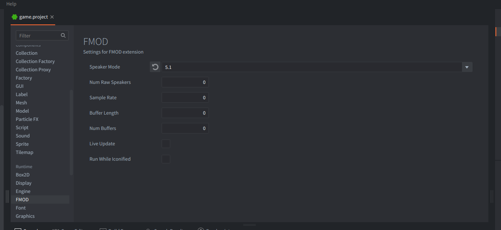

*The FMOD section in <kbd>game.project</kbd> exposes speaker mode, buffer settings, live update, and more.*

Or set them directly via your text editor in the `[fmod]` section of `game.project`:

```
[fmod]
speaker_mode = stereo
buffer_length = 512
num_buffers = 4
live_update = 1
```

### Speaker mode

Sets the output format before FMOD initialises. Most projects need this since Studio banks are mixed at a specific speaker mode. See [FMOD_System_SetSoftwareFormat](https://www.fmod.com/docs/content/generated/FMOD_System_SetSoftwareFormat.html). Supported values for `speaker_mode`: `default`, `raw`, `mono`, `stereo`, `quad`, `surround`, `5.1`, `7.1`, `max`.

You can also set `sample_rate` and `num_raw_speakers` in the same section.

### Buffer settings

If you have issues with audio stutter, adjust `buffer_length` and `num_buffers`. [More details on DSP buffer size](https://fmod.com/resources/documentation-api?version=2.0&page=core-api-system.html#system_setdspbuffersize).

### Platform-specific overrides

The following keys support a platform suffix (`_macos`, `_windows`, `_linux`, `_android`, `_ios`, `_html5`, `_switch`):

`speaker_mode`, `sample_rate`, `num_raw_speakers`, `buffer_length`, `num_buffers`, `live_update`, `run_while_iconified`

```
[fmod]
buffer_length = 512
buffer_length_android = 1024
```

### HTML5 heap size

FMOD needs enough memory for banks and sound buffers on HTML5 (particularly Safari on iOS and macOS). `load_bank_memory()` copies banks into memory, which increases usage. Increase the heap size as needed:

```
[html5]
heap_size = 512
```

## Loading banks from the file system

Loading from memory with `load_bank_memory` (as shown in Getting started) uses `custom_resources` and `resource.load()`, which is straightforward for development but inefficient for release builds since it copies the entire bank into Lua memory and does not support streaming.

For release builds, use `bundled_resources` instead. This bundles the files into the application package without loading them into Lua memory. Place your banks at the following paths relative to your `bundled_resources` directory:

| Platform | Path relative to `bundled_resources` |
|---|---|
| Windows | `win32/banks/` |
| Linux | `linux/banks/` |
| macOS | `osx/Contents/Resources/banks/` |
| iOS | `ios/banks/` |
| Android | `android/assets/banks/` |

Then load from the file system:

```lua
local bundle_path = sys.get_application_path()
local path_to_banks = bundle_path .. "/banks"
local system_name = sys.get_sys_info().system_name
if system_name == "Darwin" then
  path_to_banks = bundle_path .. "/Contents/Resources/banks"
elseif system_name == "Android" then
  path_to_banks = "file:///android_asset/banks"
end
fmod.studio.system:load_bank_file(path_to_banks .. "/Master Bank.bank", fmod.STUDIO_LOAD_BANK_NORMAL)
```

For large banks, load asynchronously with `fmod.STUDIO_LOAD_BANK_NONBLOCKING` and poll `bank:get_loading_state()` before using the bank's events.

> **Tip:** Don't use relative paths for loading banks. Use `sys.get_application_path()`. The current working directory is not always the game's installation directory, especially on macOS and iOS.

## Controlling events

Once you have an event instance, you can stop it, release it, and adjust its parameters. You can create multiple instances from the same event description and control each independently. Store instances in your script's `self` table so they stay alive across frames.

### Stopping events

Events can be stopped immediately or allowed to fade out:

```lua
event:stop(fmod.STUDIO_STOP_IMMEDIATE)
event:stop(fmod.STUDIO_STOP_ALLOWFADEOUT)
```

### Releasing events

Event instances stay alive until you call `release()` or Lua's garbage collector collects them. Since GC timing is unpredictable, calling `release()` explicitly gives you deterministic cleanup. For fire-and-forget one-shots, you can call `release()` right after `start()` and FMOD will destroy the instance once it finishes playing.

For long-lived events stored on `self`, stop and release them in `final()`. Banks should also be unloaded when no longer needed:

```lua
function final(self)
  if not fmod then return end
  self.event:stop(fmod.STUDIO_STOP_IMMEDIATE)
  self.event:release()
  self.bank:unload()
end
```

## Parameters

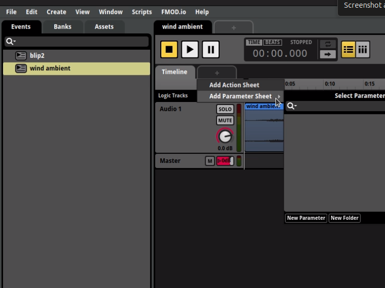

Events can have parameters that control playback behavior, like RPM for engine sounds or intensity for ambience:

```lua
event:set_parameter_by_name("RPM", 650.0, false)
```

The third argument is `ignoreseekspeed`: when `true` the value jumps immediately, when `false` it transitions gradually at the seek speed set in FMOD Studio. Immediate jumps work well for gameplay-driven parameters; gradual transitions suit musical changes.

Parameters marked as global in FMOD Studio affect all instances of events using that parameter, not just one.

## Buses and VCAs

Control mix levels through buses and VCAs defined in FMOD Studio:

```lua
local music = fmod.studio.system:get_bus("bus:/Music")
music:set_volume(0.5)
music:set_paused(true)

local master_vca = fmod.studio.system:get_vca("vca:/Master")
master_vca:set_volume(0.8)
```

## 3D audio

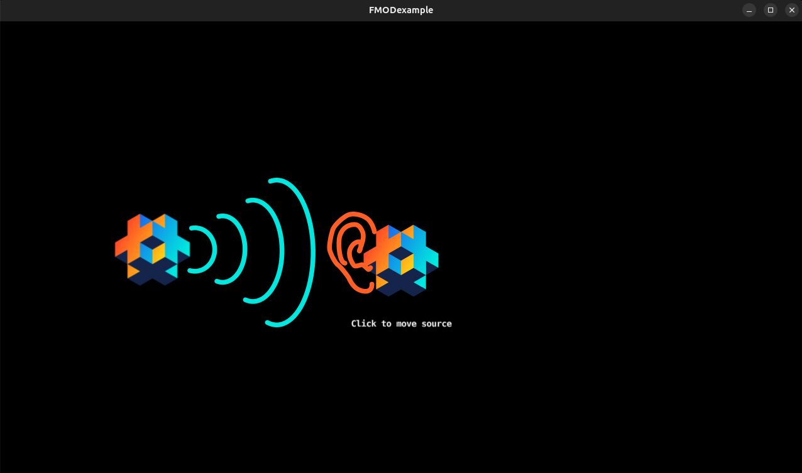

FMOD supports 3D spatial audio with listener and emitter positioning. Set up both the listener (typically the camera or player) and source positions.

### Setting up the listener

The listener represents where audio is heard from. Create 3D attributes and update them in your update loop:

```lua
local listener_attr = fmod._3D_ATTRIBUTES()
listener_attr.position = go.get_world_position("listener") * world_scale
listener_attr.velocity = vmath.vector3(0.0)
listener_attr.forward = vmath.vector3(0.0, 1.0, 0.0)
listener_attr.up = vmath.vector3(0.0, 0.0, -1.0)
fmod.studio.system:set_listener_attributes(0, listener_attr)
```

Use a world scale factor (e.g. `0.01`) to match FMOD's coordinate system with Defold's. FMOD expects distances in meters.

### Setting event 3D positions

For 3D audio events, set their position attributes the same way:

```lua
local source_attr = fmod._3D_ATTRIBUTES()
source_attr.position = go.get_world_position("source") * world_scale
source_attr.velocity = vmath.vector3(0.0)
source_attr.forward = vmath.vector3(0.0, 1.0, 0.0)
source_attr.up = vmath.vector3(0.0, 0.0, -1.0)
event:set_3d_attributes(source_attr)
```

### Updating positions

Update 3D attributes every frame. Calculate velocity from position delta for Doppler effects:

```lua
local function update_attributes(attr, dt, new_position)
  local delta_pos = new_position - attr.position
  attr.position = new_position
  attr.velocity = delta_pos * (1.0 / dt)
end

function update(self, dt)
  if not fmod then return end

  local listener_pos = go.get_world_position("listener") * world_scale
  update_attributes(self.listener_attr, dt, listener_pos)
  fmod.studio.system:set_listener_attributes(0, self.listener_attr)

  local source_pos = go.get_world_position("source") * world_scale
  update_attributes(self.source_attr, dt, source_pos)
  self.event:set_3d_attributes(self.source_attr)
end
```

For a full working example, see the [example script](https://github.com/defold/extension-fmod/blob/master/example/example.script).

## Error handling

You can retrieve the error code of an FMOD error for more specific handling:

```lua
local ok, err = pcall(function()
  return fmod.studio.system:get_event("event:/Inexistent event")
end)
if ok then
  local event_description = err
  event_description:create_instance():start()
else
  local code = fmod.error_code[err]
  if code == fmod.ERR_EVENT_NOTFOUND then
    print("Event not found")
  end
end
```

To enable FMOD's internal logging, call `fmod.debug_initialize()` early in your project. See the FMOD documentation for flag options.

## API conventions

Structs and classes are exposed on the `fmod` and `fmod.studio` namespaces. Method names are converted from `camelCase` to `snake_case`. Methods that return values through pointer arguments in C++ return the values directly in Lua and throw a Lua error when their result is not `FMOD_OK`.

Enums are exposed on the `fmod` table without the leading `FMOD_` (e.g. `FMOD_STUDIO_PLAYBACK_PLAYING` becomes `fmod.STUDIO_PLAYBACK_PLAYING`).

A fully initialised `FMOD::Studio::System` is exposed as `fmod.studio.system` and the corresponding low-level `FMOD::System` as `fmod.system`.

You can use `vmath.vector3` instead of `FMOD_VECTOR`. The extension handles the conversion.

The extension calls `fmod.studio.system:update()` from native code each frame, so you never need to call it manually.

## 64-bit values

A small number of FMOD functions and structs work with 64-bit number types. Lua 5.1 does not have a native 64-bit type. Functions with 64-bit arguments accept regular Lua numbers if the extra precision is not needed, but for full precision use `fmod.s64()` and `fmod.u64()`.

Functions that return 64-bit numbers return instances of `fmod.s64` or `fmod.u64`:

```lua
x = fmod.s64(num)         -- Convert a Lua number (up to 52 bits of integer precision)
x = fmod.s64(low, high)   -- Create from two 32-bit integers
x.value                   -- Best-effort conversion to a Lua number
x.low                     -- Lowest 32 bits as an unsigned int
x.high                    -- Highest 32 bits as an unsigned int
tostring(x)               -- Converts to a numeric string
```

## Links

* [FMOD API Documentation](https://www.fmod.com/resources/documentation-api?version=2.03.09&page=content/generated/studio_api.html)
* [Script API reference](/extension-fmod/fmod_api/)
* [Example project](https://github.com/defold/extension-fmod/blob/master/example/example.script)
* [Source code](https://github.com/defold/extension-fmod)
## API reference
[API Reference - fmod](/extension-fmod/fmod_api)
