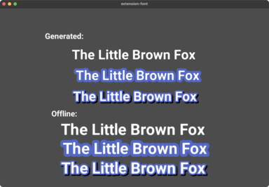

# Fontgen extension

A Defold [native extension](https://defold.com/manuals/extensions/) for interacting with fonts at runtime.

This extension allows for extending an existing Defold font (.fontc) with more glyphs at runtime.

It allows for smaller package sizes, as well as less runtime memory footprint.




# Usage

## Project Setup

We need to create an empty font file, and also bundle the project with the desired .ttf fonts.

* Create a `.font` file
    * Remove all characters from the font
        * NOTE: Currently the tools require you to have one glyph. We recommend adding a character like `.`The idea being that the character will look mostly the same between the offline/runtime generation. This restrictions will be removed later on.
* Add a `.ttf` file as a [custom resource](https://defold.com/manuals/project-settings/#custom-resources)

## Scripting setup

The developer is reponsible for adding or removing glyphs from the font, as the game engine doesn't know what text will be shown ahead of time.

### Load the .ttf font

You associate the `.fontc` with the `.ttf` font like so:
```lua
local ttf = "/assets/fonts/Roboto/Roboto-Bold.ttf" -- path to custom resource
local fontc_hash, err = fontgen.load_font("/assets/fonts/roboto.fontc", ttf)
if err ~= nil then
    print("Result:", fontc_hash, err)
end
self.font = fontc_hash
```

### Add glyphs to the font

Before showing any text, the developer need to make sure the glyphs are generated.
The call to `fontgen.add_glyphs()` is asynchronous, and allows you to supply a callback, which will be called when the glyphs are generated, and it's safe to display the text.

```lua
local chars = " !\"#$%&'()*+,-./0123456789:;<=>?@ABCDEFGHIJKLMNOPQRSTUVWXYZ[\\]^_`abcdefghijklmnopqrstuvwxyz{|}~"

local request = fontgen.add_glyphs(self.font, chars, function (self, id, result, errmsg)
        if not result then
            print("Request " .. id .." finished with error:", errmsg)
        else
            print("Request " .. id .." finished successfully")
        end
    end)
```

### Remove glyphs to the font

If required, it is also possible to remove glyphs. This may beneficial if memory is needed to be kept at a minimum.

```lua
fontgen.remove_glyphs(self.font, "DEFdef")
```

### Unload the font

WHen the font is not needed anymore, you can unload it.
This also removes the currently generated glyphs.

```lua
fontgen.unload_font(self.font)
```


# Known limitations:

* You need to add your .ttf font as a [Custom Resource](https://defold.com/manuals/project-settings/#custom-resources)
* It is not recommended to mix glyphs from the default (offline) glyph generator and this runtime generator.
    * Note: It is possible to override the previous glyphs at runtime, making the look consisten
* Currently only supports SDF fonts
* No caching to disc of the the generated glyphs


# Game.project Properties

_See [ext.properties](http://github.com/defold/extension-fontgen/fontgen/ext.properties) for the up-to-date list of settings._

* `fontgen.sdf_base_padding` - The base padding when generating sdf glyphs [0-255]
* `fontgen.sdf_edge_value` - The on edge when generating sdf glyphs. [0-255]

# Api

[Script Api](https://defold.com/extension-fontgen/fontgen_api/)


# Font Credits

* [Roboto](https://fonts.google.com/specimen/Roboto) by [Christian Robertson](https://fonts.google.com/?query=Christian+Robertson)
[API Reference - fontgen](/extension-fontgen/fontgen_api)
