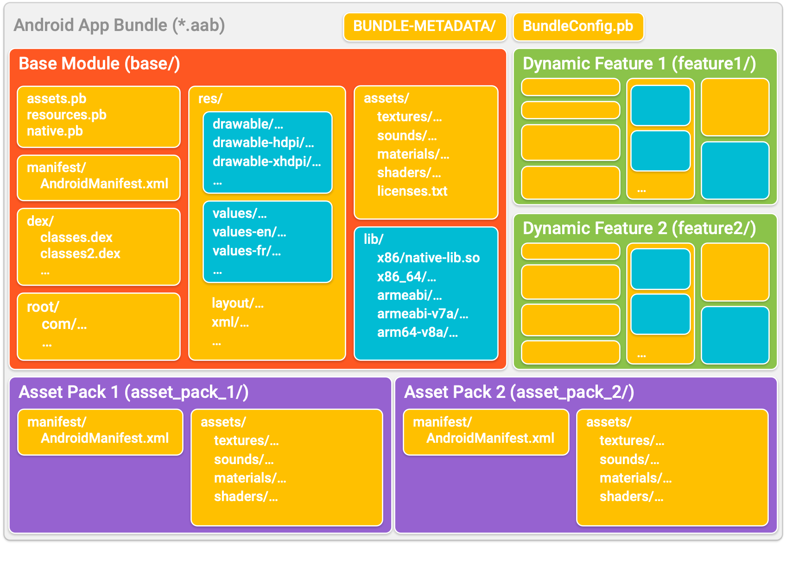

# Play Asset Delivery

Play Asset Delivery uses asset packs, which are hosted and served on Google Play removing the need to use a content delivery network (CDN) to get your game resources to players. Through Dynamic Delivery, you can customize how and when each asset pack is downloaded onto a device according to three delivery modes: install-time, fast-follow, and on-demand. Asset packs can be used to download Live Update zip archives or individual files such as images, sounds, json data etc


## Installation

To use Play Asset Delivery in your Defold project, add a version of the Play Asset Delivery extension to your `game.project` dependencies from the list of available [Releases](https://github.com/defold/extension-pad/releases). Find the version you want, copy the URL to ZIP archive of the release and add it to the project dependencies.


Select `Project->Fetch Libraries` once you have added the version to `game.project` to download the version and make it available in your project.


## Creating asset packs

Creating an asset packs involves using the Android tools `aapt2` and `bundletool` and the JDK tool `jarsigner`. All are included in the Defold command line tool `bob.jar` and can be used directly from Bob. There are four steps to create one or more asset packs and include them in the application bundle:

1. Compile assets
2. Create asset bundles
3. Add asset bundles to application bundle
4. Sign the application bundle


### Compile assets

The first step is to run `aapt2` to prepare files for use by the bundle tool. The `aapt2` command takes an `AndroidManifest.xml` and a folder of assets as input and outputs processed files to an output folder. When used as shown below `aapt2` will copy the assets and write a binary version of the `AndroidManifest.xml` to the output folder. The command will also produce a `resources.pb` but this is not needed for assets packs.

```sh
java -jar bob.jar aapt2 link --proto-format --output-to-dir -o out --manifest AndroidManifest.xml -A assets
# resources.pb is not needed for asset packs
rm out/resources.pb
```

The `AndroidManifest.xml` configures the asset pack's identifier and delivery mode:

```xml
<?xml version="1.0" encoding="utf-8"?>
<manifest xmlns:dist="http://schemas.android.com/apk/distribution" package="com.defold.pad" split="asset_pack_1">
    <dist:module dist:type="asset-pack">
        <dist:delivery>
            <dist:on-demand/>
        </dist:delivery>
        <dist:fusing dist:include="true"/>
    </dist:module>
</manifest>
```

Pay attention to the `<dist:delivery>` tag which specifies the [delivery mode](https://developer.android.com/guide/playcore/asset-delivery).


### Create asset bundle

The next step is to create an asset bundle using the `bundletool` command. The `bundletool` command will produce an .aab file from a bundle configuration and a zip file containing the assets and the binary version of the manifest file produced by `aapt2` above.

```sh
java -jar bob.jar bundletool build-bundle --modules asset_pack_1.zip --config bundleconfig.json --output asset_pack_1.aab
```

The `asset_pack_1.zip` must have the following structure:

```
<root>
├── assets
│   └── <file(s)>
└── manifest
    └── AndroidManifest.xml   <-- binary version from aapt2
```

The `bundleconfig.json` is only needed to tell `bundletool` that it is producing a bundle containing only assets:

```json
{
  "type": "ASSET_ONLY"
}
```


### Add asset bundles to the application bundle

When all asset bundles have been produced they need to be merged into the the main application bundle. For each asset bundle unzip it, remove the `bundleconfig.pb` and then write the files to the main application bundle.

```sh
unzip asset_pack_1.aab -d out
cd out
# bundleconfig.pb is not needed
rm bundleconfig.pb
# -D do not write directory entries to the archive
zip -r -0 -D main.aab .
```

To better illustrate the final folder structure inside the main application bundle, please refer to the Android Application Bundle Format reference image ([source](https://developer.android.com/guide/app-bundle/app-bundle-format)):




### Resign the main application bundle

The final step involves resigning the main application bundle:

```sh
java -jar bob.jar jarsigner -verbose -keystore debug.keystore -storepass android -keypass android main.aab androiddebugkey
```

Note that `jarsigner` can also load the keystore and key password from a file:

```sh
java -jar bob.jar jarsigner -verbose -keystore debug.keystore -storepass file:storepass.txt -keypass file:keypass.txt main.aab androiddebugkey
```


## Usage

The Play Asset Delivery API is available in Lua through the `pad.*` namespace of functions:

```lua
pad.set_listener(function(_, event)
	print(event.pack_name)
	print(event.event_type) -- see pad.EVENT_XYZ
	print(event.extra)
	if event.event_type == pad.EVENT_PACK_STATE_UPDATED then
		local status = pad.get_pack_status(event.pack_name) -- see pad.STATUS_XYZ
		if status == pad.STATUS_TRANSFERRING then
			print(pad.get_pack_bytes_downloaded(event.pack_name))
			print(pad.get_pack_total_bytes_to_download(event.pack_name))
			print(pad.get_pack_transfer_progress_percentage(event.pack_name))
		elseif status == pad.STATUS_COMPLETED then
			local location = pad.get_pack_location(event.pack_name)
			local f = io.open(location .. "/myfile.json", "rb")

		end
		print(pad.get_pack_error_code(event.pack_name)) -- see pad.ERRORCODE_XYZ
	end
end)

-- get pack state, will call event listener with pad.EVENT_PACK_STATE_UPDATED
pad.get_pack_state("asset_pack_1")

-- start fetching asset pack
-- progress and status will be reported in the listener
pad.fetch("asset_pack_1")

-- cancel download of a pack
pad.cancel("asset_pack_1")

-- remove an on-demand packed that has been fetched
pad.remove_pack("asset_pack_1")
```

## Example

[Refer to the example project](https://github.com/defold/extension-pad/blob/master/example) to see a complete example of how the integration works.

## Source code

The source code is available on [GitHub](https://github.com/defold/extension-pad)
## API reference
[API Reference - pad](/extension-pad/pad_api)
