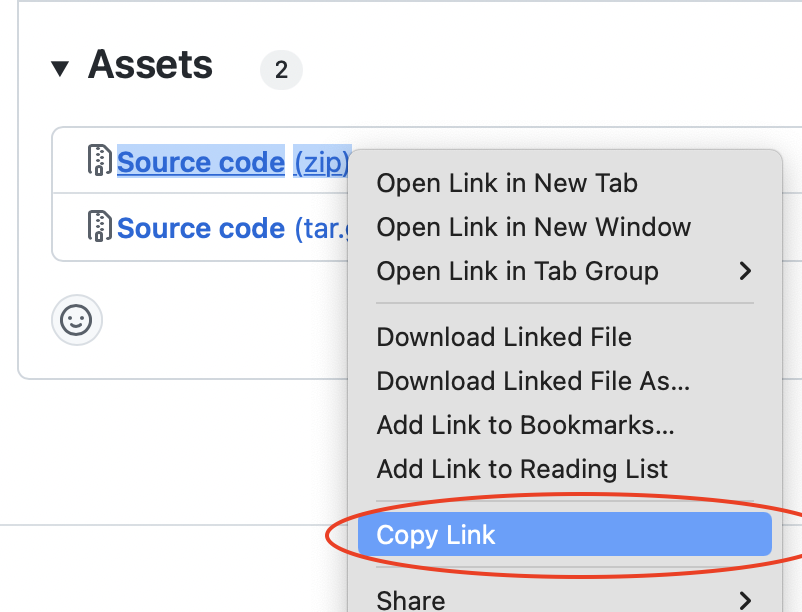

# Play Asset Delivery

Play Asset Delivery uses asset packs, which are hosted and served on Google Play removing the need to use a content delivery network (CDN) to get your game resources to players. Through Dynamic Delivery, you can customize how and when each asset pack is downloaded onto a device according to three delivery modes: install-time, fast-follow, and on-demand. Asset packs can be used to download Live Update zip archives or individual files such as images, sounds, json data etc


## Installation

To use Play Asset Delivery in your Defold project, add a version of the Play Asset Delivery extension to your `game.project` dependencies from the list of available [Releases](https://github.com/defold/extension-pad/releases). Find the version you want, copy the URL to ZIP archive of the release and add it to the project dependencies.



Select `Project->Fetch Libraries` once you have added the version to `game.project` to download the version and make it available in your project.


## Creating asset packs

Creating an asset packs involves using the Android Gradle plugin. The steps to create one or more asset packs and include them in the application bundle:

1. Prepare asset packs
2. Create asset packs
3. Add asset packs to application bundle
4. Sign the application bundle


### Prepare asset packs

Each asset pack should be placed in a separate folder and consist of one or more files and a `build.gradle` file describing the asset pack. There should also be one main `build.gradle` file and one `settings.gradle`. Example folder structure for two asset packs, `asset_pack_1` and `asset_pack_2`:

```
<root>
├── asset_pack_1
│   ├── src
│   │   └── main
│   │       └── assets
│   │           └── <file(s)>
│   └── build.gradle
├── asset_pack_2
│   ├── src
│   │   └── main
│   │       └── assets
│   │           └── <file(s)>
│   └── build.gradle
├── build.gradle
└── settings.gradle
```

The `build.gradle` file in the asset pack folder defines the asset pack name and the [delivery mode](https://developer.android.com/guide/playcore/asset-delivery):

```
apply plugin: 'com.android.asset-pack'

assetPack {
    packName = "asset_pack_1"
    dynamicDelivery {
        deliveryType = "install-time"
    }
}
```

The main `build.gradle` file sets up the Android Gradle plugin and lists the asset packs:

```
allprojects {
    repositories {
        google()
        mavenCentral()
    }
}

buildscript {
    repositories {
        google()
        mavenCentral()
    }
    dependencies {
        classpath 'com.android.tools.build:gradle:8.13.0'
    }
}

apply plugin: 'com.android.application'

android {
    compileSdkVersion 34

    namespace = "com.defold.pad"

    assetPacks = [":asset_pack_1", ":asset_pack_2"]
}
```

The `settings.gradle` is responsible for including the `build.gradle` files in the asset pack sub-folders:

```
include ':asset_pack_1'
include ':asset_pack_2'
```

You can see the complete set up in the example project included with the Play Asset Delivery extension https://github.com/defold/extension-pad/tree/master/assetpacks


### Create asset packs

The next step is to create the asset packs using the Android Gradle plugin and the `assetPackDebugPreBundleTask` command:


```sh
gradle assetPackDebugPreBundleTask
```

The command will produce a .zip file for each asset pack. The zip files will be created in `/build/intermediates/asset_pack_bundle/debug/assetPackDebugPreBundleTask/`. Example:

```
<root>
└── build
    └── intermediates
        └── asset_pack_bundle
            └── debug
                ├── asset_pack_1
                │   └── asset_pack_1.zip
                └── asset_pack_2
                    └── asset_pack_2.zip
```


### Add asset packs to the application bundle

When all asset packs have been produced they need to be merged into the the main application bundle. For each `fast-follow` and `on-demand` asset pack unzip and write the files to the main application bundle:

```sh
unzip asset_pack_1.zip -d out
cd out
# -D do not write directory entries to the archive
zip -r -0 -D main.aab .
```

For each `install-time` asset pack unzip and write the asset files to the `base/assets/` folder:

```sh
unzip asset_pack_1.zip -d out
cd out
# the manifest/AndroidManifest.xml of the install-time asset pack must be deleted
rm -rf manifest
# the files need to be written to the base folder
mv asset_pack_1 base
# -D do not write directory entries to the archive
zip -r -0 -D main.aab .
```

To better illustrate the final folder structure inside the main application bundle, please refer to the Android Application Bundle Format reference image ([source](https://developer.android.com/guide/app-bundle/app-bundle-format)):


### Resign the main application bundle

The final step involves resigning the main application bundle:

```sh
java -cp bob.jar com.dynamo.bob.tools.AndroidTools jarsigner -verbose -keystore debug.keystore -storepass android -keypass android main.aab androiddebugkey
```

Note that `jarsigner` can also load the keystore and key password from a file:

```sh
java -cp bob.jar com.dynamo.bob.tools.AndroidTools jarsigner -verbose -keystore debug.keystore -storepass file:storepass.txt -keypass file:keypass.txt main.aab androiddebugkey
```


## Usage

The Play Asset Delivery API is available in Lua through the `pad.*` namespace of functions:

```lua
pad.set_listener(function(_, event)
	print(event.pack_name)
	print(event.event_type) -- see pad.EVENT_XYZ
	print(event.extra)
	if event.event_type == pad.EVENT_PACK_STATE_UPDATED then
		local status = pad.get_pack_status(event.pack_name) -- see pad.STATUS_XYZ
		if status == pad.STATUS_TRANSFERRING then
			print(pad.get_pack_bytes_downloaded(event.pack_name))
			print(pad.get_pack_total_bytes_to_download(event.pack_name))
			print(pad.get_pack_transfer_progress_percentage(event.pack_name))
		elseif status == pad.STATUS_COMPLETED then
			local location = pad.get_pack_location(event.pack_name)
			local f = io.open(location .. "/myfile.json", "rb")

		end
		print(pad.get_pack_error_code(event.pack_name)) -- see pad.ERRORCODE_XYZ
	end
end)

-- get pack state, will call event listener with pad.EVENT_PACK_STATE_UPDATED
pad.get_pack_state("asset_pack_1")

-- start fetching asset pack
-- progress and status will be reported in the listener
pad.fetch("asset_pack_1")

-- cancel download of a pack
pad.cancel("asset_pack_1")

-- remove an on-demand packed that has been fetched
pad.remove_pack("asset_pack_1")
```

## Example

[Refer to the example project](https://github.com/defold/extension-pad/blob/master/example) to see a complete example of how the integration works.

## Source code

The source code is available on [GitHub](https://github.com/defold/extension-pad)
## API reference
[API Reference - pad](/extension-pad/pad_api)
