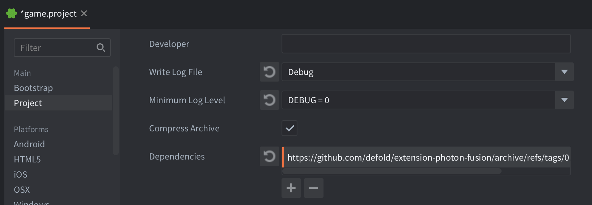

# SDK & Installation

## Requirements
* Fusion 3 AppId ([Photon Dashboard](https://dashboard.photonengine.com/))
* Defold 1.12.0 or newer

## License
You must read and agree to the [Exit Games End User License Terms](https://github.com/defold/extension-photon-fusion/blob/master/fusion/license.txt) before using Photon Fusion in your own project.

## Installation
To use the Photon Fusion SDK in your Defold project, add a version of the Photon Fusion extension to your `game.project` dependencies from the list of available [Releases](https://github.com/defold/extension-photon-fusion/releases). Find the version you want, copy the URL to ZIP archive of the release and add it to the project dependencies.

Select `Project->Fetch Libraries` once you have added the version to `game.project` to download the version and make it available in your project.

## Source code
The source code is available on [GitHub](https://github.com/defold/extension-photon-fusion)

## Where to Go Next
* [Back to the Introduction](index)
* [Quick Start Guide](quick-start-guide) — Build a multiplayer demo in 10 steps