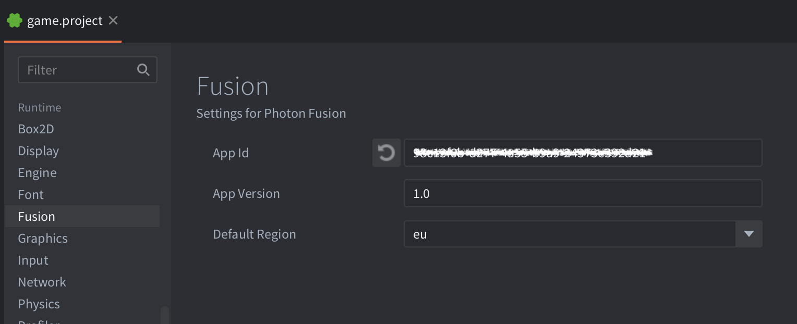
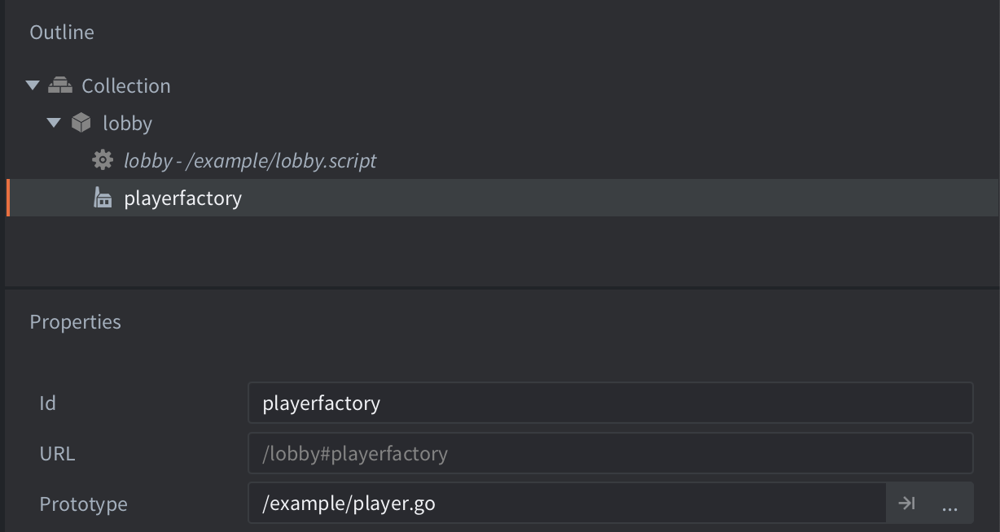
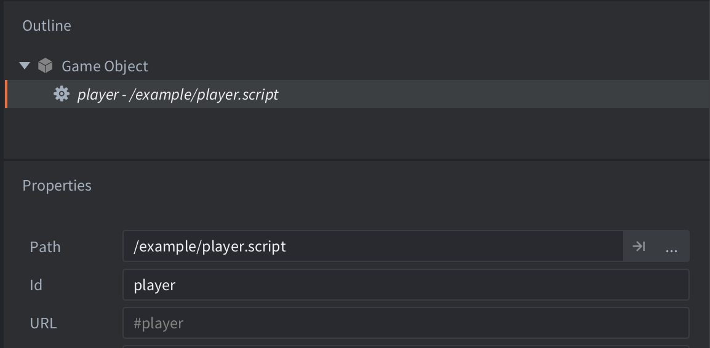
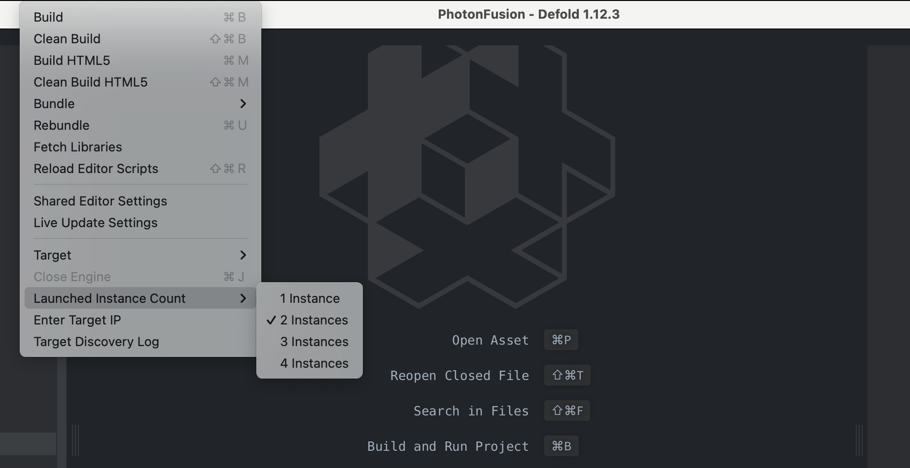

<div class='important' markdown='1'>
Fusion Defold SDK 3 is a development preview and is not intended for production use yet.
</div>

# Introduction
This guide shows how to build a simple multiplayer game/application using the Photon Fusion extension for Defold. It covers app id creation, connection, spawning, movement replication, custom properties and RPCs. By the end, two clients will move around the same room and see each other in real time.

[Requirements](installation): Installed Defold editor and basic knowledge of Lua and Defold.


## Step 1 - Photon Account and App IDs
Fusion runs on the Photon Cloud. The App ID ties your project to a backend that handles connection, authentication, matchmaking and finally state distribution. Follow these steps to create a new App ID to use for the rest of this guide:

1. Create or log on to an account at dashboard.photonengine.com.
2. Click Create a New App, select Fusion as the SDK, and Version 3 (used for both Unreal and Defold).
3. Copy the App ID.


## Step 2 - Install Fusion
To use Photon Fusion in your Defold project, add a version of the Photon Fusion extension to your `game.project` dependencies from the list of available [Releases](https://github.com/defold/extension-photon-fusion/releases). Find the version you want, copy the URL to ZIP archive of the release and add it to the project dependencies.


Select `Project->Fetch Libraries` once you have added the version to `game.project` to download the version and make it available in your project.


## Step 3 - Fusion Extension Settings
Photon Fusion can conveniently use pre-defined values at startup when you call `fusion.initialize_from_settings()`. Set your credentials in **game.project** > Runtime > Fusion:

* App Id - your Photon App ID created on step 1.
* App Version - a version string can be used to isolate matchmaking (e.g. "1.0")
* Default Region - Photon region (e.g. "us", "eu")



With basic credentials set, it's time to prepare a bootstrap collection.


## Step 4 - Bootstrap Collection
In Defold, everything is organized in collections, which are organized as hierarchies of game objects and components. A bootstrap collection is an entry point from where you can load other collections, start a game, etc.

For this guide, the bootstrap collection's role is to connect to Fusion's Photon infrastructure, create/join a room, and spawn a client-controlled game object to represent the "player". For this, the scene must contain a Factory component to spawn a Player game object and a Script component to handle the connection logic.

Here's an example of how this collection can be structured. It should contain a game object with two components: a Script component to start the connection logic, and a Factory component to spawn player game objects:




## Step 5 - Connect and Join
Connection is a two-step flow: reach the Photon master server first, then join or create a room. The room is where replication and RPCs actually happen. The function below will run when the game starts and it tells Fusion to immediately connect and try to join a room or create one in case there is none currently:


```lua
function init(self)
	-- initialize random seed from current time
	math.randomseed(os.time())
	-- generate a random username
	local user_id = "user_" .. math.random()

	-- initalize fusion
	fusion.init_from_settings()
	-- connect to master server
	fusion.connect(user_id)
	-- wait for connection event, then join room
	fusion.on_event(function(self, event, data)
		if event_id == fusion.EVENT_CONNECTED then
			fusion.join_or_create_room("lobby")
		end
	end)
end
```

Once in a room, you are ready to spawn and control other game objects. The only missing piece now is the function connected to the `fusion.EVENT_ROOM_JOINED` event.


## Step 6 - Player game object
Each player is a game object with a Script component. When the player is spawned using `fusion.spawn()` all of it's properties will get synced over the network.



Now spawning can be triggered when a client enters the room.


## Step 7 - Spawn on Join
When the `fusion.EVENT_ROOM_JOINED` event is received in the event handler that was registered on step 5, it is time to spawn a player instance by calling `fusion.spawn()`. This function handles the network side: it assigns a unique ID, sends a spawn message to the cloud-based server, which is propagated to the other clients that then create a matching instance. This is also automatically handled for late joiners, as the server will be responsible for caching and distributing not only the spawn/destroy, but also the current state of every networked scene/object.

```lua
	fusion.on_event(function(self, event, data)
		if event_id == fusion.EVENT_CONNECTED then
			fusion.join_or_create_room("lobby")
		elseif event_id == fusion.EVENT_ROOM_JOINED then
			local pos = vmath.vector3(math.random(100, 700), math.random(100, 500), 0)
			local id = fusion.spawn("#playerfactory", pos)
			print("joined room and spawned player with id:", id, "at:", pos)
		end
	end)
```

The scripts should be working now, and it is possible to connect to Photon, create/join rooms. The player game object is also being spawned but sits still. Let's add input to move it around.


## Step 8 - Movement
Only the authority client (in this case the one that spawned it) should process input. Everyone else will automatically get the position updates through replication which also smooths it automatically. Here is the code for the Script component to be attached to the player scene.

```lua
local SPEED = 200

function init(self)
	self.dir = vmath.vector3(0)
end

function on_message(self, message_id, message, sender)
	if message_id == fusion.EVENT_OBJECT_READY then
		-- make sure this script is added to the input queue
		if fusion.has_authority() then
			msg.post(".", "acquire_input_focus")
		end
	end
end

function on_input(self, action_id, action)
	if action_id == hash("move_left") then
		self.dir.x = -action.x
	elseif action_id == hash("move_right") then
		self.dir.x = action.x
	elseif action_id == hash("move_down") then
		self.dir.y = -action.y
	elseif action_id == hash("move_up") then
		self.dir.y = -action.y
	elseif 
end

function update(self, dt)
	if fusion.has_authority() then
		local pos = go.get_position()
		pos = pos + dir * SPEED * dt
		go.set_position(pos)
	end
end
```

To test, you can add this script to the player game object.

When the `fusion.EVENT_OBJECT_READY` is received, Fusion will already correctly indicate if the object can be controlled locally. It also controls object movement based on the authority information. This means only the client who "owns" this object can apply changes to it (remote clients should not write to objects they do not own, as this would not be propagated anyway, neither from its client, nor by the server).


## Step 9 - Test
Defold can easily launch multiple instances from the same editor, which makes local testing straightforward.

* Set Project > Launched Instance Count > 2.
* Select Project > Build, both instances should connect (or click Connect in each window if a button was used).
* Both clients join the same room and should see each other's player objects. That covers the core loop. The next two steps layer on gameplay features




## Step 10 - Custom Properties
Not implemented yet.


## Step 11 - RPCs
Not everything in a game is continuous state. One-shot events like chat messages, hit notifications or ability triggers (anything that requires a modification on an object the local client does not own, for example) may be better sent as RPCs. Be aware that RPCs fire once, and while they are reliably delivered, they are not stored in server state buffer, so late joiners won't receive them.

```lua
local function send_message()
	fusion.rpc(0, "show_message", "Hello!")
end

function init(self)
	fusion.on_event(function(self, event, data)
		if event_id == fusion.EVENT_RPC then
			if event == hash("show_message") then
				print(data)
			end
		end
	end)
end
```

To test the RPCs you can add the above code to the movement script and then also extend the `on_input()` function with the following:


```lua
function on_input(self, action_id, action)
	if action_id == hash("say_hi") then
		send_message()
	end
end
```

After that when you press the key bound to the `say_hi` action, the message "Hello!" is printed on both clients.

See [RPCs](rpcs) for broadcast RPCs and more target delivery variations.

## Next Steps
This guide covered basics of connect, spawn, replicate, RPCs. Each of these topics has a dedicated manual page that goes deeper. Here is a list of suggested next learning steps:

* [Connection](connection) - full connection lifecycle
* [Replication](replication) - authority and replication modes
* [Spawning](spawning) - spawn configuration and sub-objects
* [RPCs](rpcs) - object and broadcast RPCs
* [Physics Replication](physics-replication) - forecast smoothing
* [Large Scenes](large-scenes) - pre-placed networked nodes