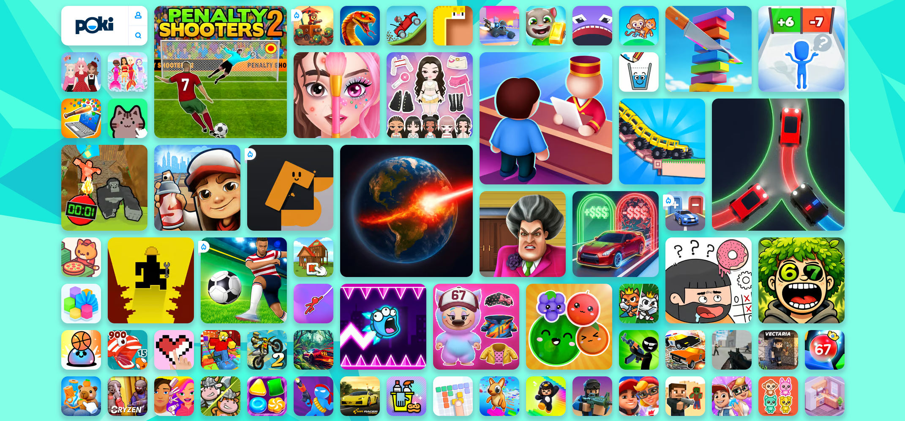
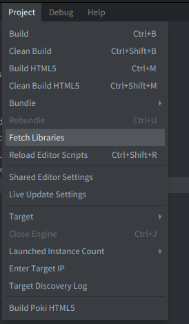
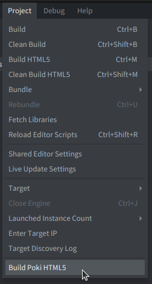
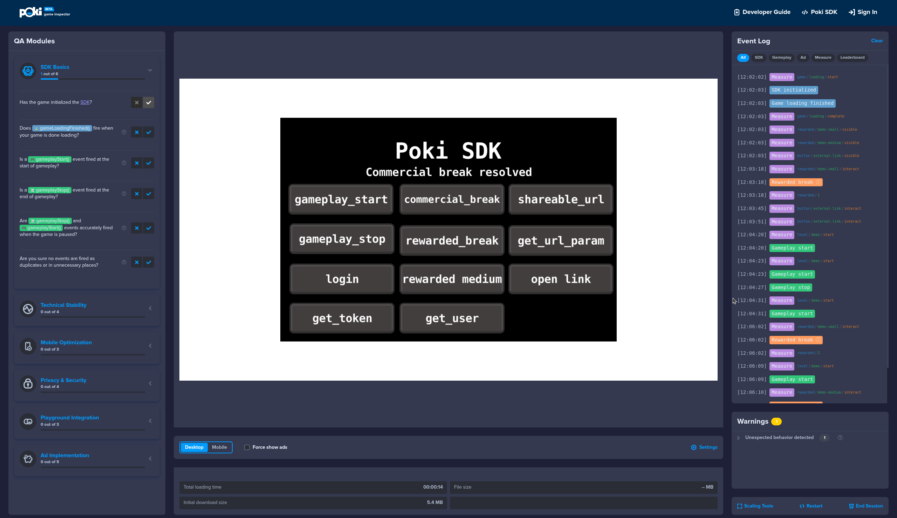
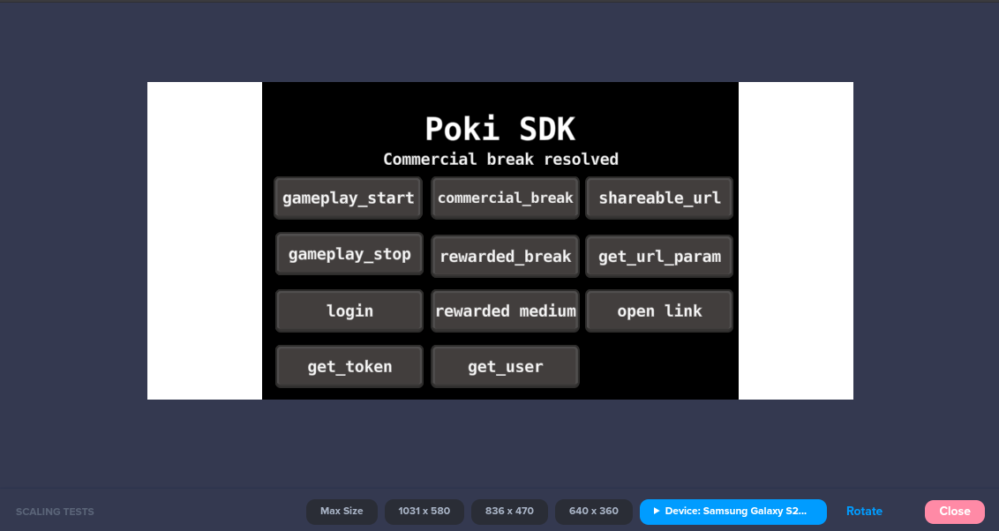
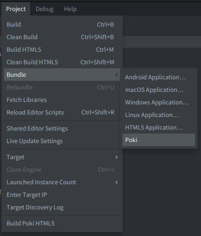
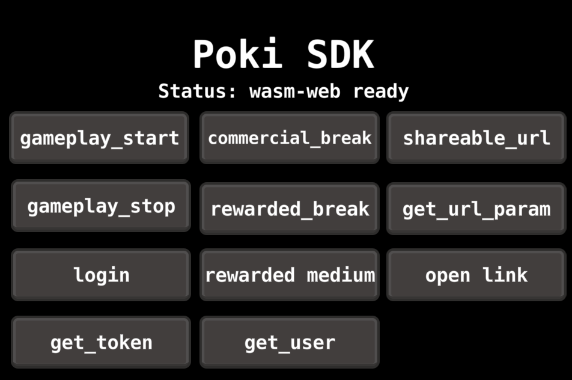

# Defold Poki SDK extension API documentation

This [Defold native extension](https://defold.com/manuals/extensions/) provides access to the Poki SDK from Lua and supplies Poki-specific HTML5 loading, build, and bundle integration. [Poki](https://poki.com) is an online playground where players and game developers come together to play and create. The games on Poki are created by a diverse global game developer community. Got a game? Submit it via [developers.poki.com](https://developers.poki.com).



<div class='important' markdown='1'>
Defold 1.13.0 or newer use `wasm-web` only. Defold 1.13.0 removed `js-web`; legacy asm.js builds are not supported.
</div>

## Best practices

Before you dive in and start integrating the Poki SDK in your game it is recommended that you learn about some of the [best practices when building for the web](best-practices).


## Getting started

### Step 1 - Installation

To use Poki SDK in your Defold project, add a version of the Poki SDK extension to your `game.project` dependencies:

```text
https://github.com/defold/extension-poki-sdk/archive/refs/tags/<version>.zip
```

Replace `<version>` with the version you want to use, or copy the ZIP URL from the list of available [Releases](https://github.com/defold/extension-poki-sdk/releases).


Select `Project->Fetch Libraries` once you have added the version to `game.project` to download the version and make it available in your project.



### Poki editor commands

The extension adds two commands to the Defold editor:

- **Project → Build Poki HTML5** builds a debug `wasm-web` bundle and opens it in the Poki Inspector.



Keep the Defold editor open while testing: it serves the local HTML5 build to the browser.

The [Poki Inspector](https://inspector.poki.dev/) helps you verify the integration before uploading the game:

- inspect SDK, gameplay, ad, and `measure()` activity in the Event Log, together with detected errors and warnings;
- work through the QA Modules checklist and review the total loading time and initial download size;
- perform Scaling Tests (see below)'
- run Inspector experiments such as Mute, Time, Assets, and Dark Mode;
- generate a QR code or URL to open the local build on a mobile device while continuing to inspect its SDK events in the desktop browser.

See the [Poki Inspector guide](https://sdk.poki.com/poki-inspector) for the complete testing workflow.



Use Scaling Tests to try different resolutions, aspect ratios, and mobile-device presets, including rotating supported devices to check portrait and landscape behavior—see the [Defold GUI layouts manual](https://defold.com/manuals/gui-layouts/) for building adaptive interfaces;



- **Project → Bundle → Poki** creates a `wasm-web` bundle, packages it as `poki.zip`, and opens the Poki upload flow.



### Step 2 - Implement the gameplay events

Use the `poki_sdk.gameplay_start()` event to describe when users are playing your game (e.g. on first user interaction and unpause).

Use the `poki_sdk.gameplay_stop()` event to describe when users aren’t playing your game (e.g. level finish, game over, pause, quit to menu).

```lua
-- first level loads, player clicks anywhere
poki_sdk.gameplay_start()
-- player is playing
-- player loses round
poki_sdk.gameplay_stop()
-- game over screen pops up
```

### Step 3 - Implement commercial breaks

Commercial breaks are used to display video ads and should be triggered on natural breaks in your game. Throughout the rest of your game, we recommend you implement the `poki_sdk.commercial_break()` before every `poki_sdk.gameplay_start()`, i.e. whenever the user has shown an intent to continue playing.

The Lua callback represents Poki's `commercialBreak(startCallback).then(...)` flow: it receives `COMMERCIAL_BREAK_START` if Poki invokes the start callback, then `COMMERCIAL_BREAK_SUCCESS` when the promise resolves. A break opportunity does not necessarily display an ad.

```lua
-- gameplay stops
poki_sdk.commercial_break(function(self, status)
  if status == poki_sdk.COMMERCIAL_BREAK_START then
    print("Commercial break started, pause game")
  elseif status == poki_sdk.COMMERCIAL_BREAK_SUCCESS then
    print("Commercial break finished or did not happen")
  end
end)
```

<div class='important' markdown='1'>
Not every single `poki_sdk.commercial_break()` will trigger an ad. Poki’s system will determine when a user is ready for another ad, so feel free to signal as many commercial break opportunities as possible.
</div>


### Step 4 - Implement rewarded breaks

Rewarded breaks allow for a user to choose to watch a rewarded video ad in exchange for a certain benefit in the game (e.g. more coins, etc.). When using `poki_sdk.rewarded_break()`, please make it clear to the player beforehand that they’re about to watch an ad.

The Lua callback maps Poki's `rewardedBreak({ size, onStart }).then(success => ...)` flow to statuses. It receives `REWARDED_BREAK_START` if Poki invokes `onStart`, followed by `REWARDED_BREAK_SUCCESS` when the promise resolves to `true` or `REWARDED_BREAK_ERROR` when it resolves to `false`.

```lua
-- gameplay stops
poki_sdk.rewarded_break(function(self, status)
  if status == poki_sdk.REWARDED_BREAK_ERROR then
    print("Rewarded break resolved without a reward")
  elseif status == poki_sdk.REWARDED_BREAK_START then
    print("Rewarded break started")
  elseif status == poki_sdk.REWARDED_BREAK_SUCCESS then
    print("Rewarded break success")
  end
end)
```

You can also request a reward size of `"small"`, `"medium"`, or `"large"`. Omitting it defaults to `"small"`:

```lua
poki_sdk.rewarded_break("medium", function(self, status)
  if status == poki_sdk.REWARDED_BREAK_SUCCESS then
    print("Grant the medium reward")
  end
end)
```

Learn more about rewarded ads in the [Poki monetization guide](https://developers.poki.com/guide/monetization).

<div class='sidenote' markdown='1'>
Calling `poki_sdk.rewarded_break()` affects the timing of `poki_sdk.commercial_break()` - When a user interacts with a rewarded break, our system’s ad timer is reset to ensure the user does not immediately see another ad.
</div>


### Step 5 - Pause game and disable input during ads

Make sure that the game is paused and keyboard inputs are disabled during `commercial_break` and `rewarded_break`, so that the game doesn’t interfere with the ad:

```lua
-- gameplay stops
poki_sdk.rewarded_break(function(self, status)
  if status == poki_sdk.REWARDED_BREAK_START then
    print("Rewarded break start, pause game and disable input")
  elseif status == poki_sdk.REWARDED_BREAK_ERROR or status == poki_sdk.REWARDED_BREAK_SUCCESS then
    print("Rewarded break finished or did not happen, unpause game and enable input")
  end
end)
```

<div class='important' markdown='1'>

Beginning with Poki Extension 3.3.0, sound will be muted automatically when ADS are shown.

</div>

### Step 6 - Implement custom events

Use `poki_sdk.measure(category, what, action)` to record meaningful checkpoints in a game. Parameters can be any strings. The Defold binding defaults omitted `what` and `action` to empty strings for compatibility, but this fallback is not the recommended event shape. Use custom strings for meaningful game events. Choose short, stable values that remain comparable across game versions:

- `category` is the broad group, such as `"level"`, `"button"`, `"rewarded"`, or `"cosmetic"`.
- `what` identifies the specific level, placement, button, item, or system.
- `action` describes what happened. Poki gives special reporting meaning to `start`, `complete`, `fail`, `visible`, and `interact`; custom action values are also accepted.

<div class='important' markdown='1'>
Commercial and rewarded ad playback and outcomes are tracked automatically through `poki_sdk.commercial_break()` and `poki_sdk.rewarded_break()`. Do not send `measure()` events for ad impressions, playback, completion, failure, or reward grant. Rewarded `visible` and `interact` events describe only the in-game offer UI.
</div>

See [Poki's Game Events documentation](https://sdk.poki.com/game-events) for more patterns and reporting guidance.

Some good practices for events:

#### Progress events

Measure users progress to get statistics on how players are doing in your game.
Use the same category and `what` value for an attempt. Send `start`, followed by either `complete` or `fail` - never both for the same attempt:

```lua
-- Tutorial attempt
poki_sdk.measure("level", "tutorial", "start")
poki_sdk.measure("level", "tutorial", "complete") -- or "fail"

-- Level attempt
poki_sdk.measure("level", "1", "start")
poki_sdk.measure("level", "1", "complete") -- or "fail"
```

#### Rewarded offer events

Measure statistics regarding rewarded ads offerings - when these are visible for players and when players decide to use them.
Measure the in-game offer that leads to a rewarded video. Send `visible` when the offer becomes visible and `interact` when the player chooses it:

```lua
-- The treasure-chest offer is shown.
poki_sdk.measure("rewarded", "treasure-chest", "visible")

-- The player chooses the offer, immediately before requesting the ad.
poki_sdk.measure("rewarded", "treasure-chest", "interact")
poki_sdk.rewarded_break(function(self, status)
  if status == poki_sdk.REWARDED_BREAK_SUCCESS then
    -- Grant the treasure-chest reward.
  end
end)
```

The placement name should describe the offer, not the ad result. Use the same category and placement for both events so exposure and engagement can be compared.

#### UI Interaction events

Measure other key gameplay or UI elements that might help you shape your game to better suit players or help them navigate to desired places.
The same `visible` and `interact` pair can be applied to shops, buttons, upgrades, power-ups, and other UI:

```lua
-- The shop button becomes visible in the menu.
poki_sdk.measure("button", "shop", "visible")

-- The player opens the shop.
poki_sdk.measure("button", "shop", "interact")

-- The player sees and selects a shop item.
poki_sdk.measure("shop-item", "extra-coins", "visible")
poki_sdk.measure("shop-item", "extra-coins", "interact")
```

#### Meta-game or cosmetic upgrades events

Mesaure when player decide to get cosmetic upgrades or interact with meta-game features:

```lua
-- Count milestones and item-specific cosmetic unlocks.
poki_sdk.measure("cosmetic", "items", "unlock-2")
poki_sdk.measure("cosmetic", "hat", "unlocked")
```

#### Difficulty change events

Detect when player changes difficulty level if your game supports it, so that you know if these are suited for most players.

```lua
-- Measure difficulty changes
poki_sdk.measure("difficulty", "hard", "selected")
```

### Step 7 - Upload and test your game in Poki for Developers

Congrats, you’ve successfully implemented the Poki SDK! Now upload your game to the Poki Inspector and test it there. When you’re happy with the implementation, send Poki a review request and they'll play the game. Feel free to contact Poki via Discord or developersupport@poki.com if you’re stuck.


## Advanced topics

### Safe calls in non-HTML5 builds

The Lua module is available only in HTML5 builds. When your project is also meant to be run on another platform safe guard Poki extension calls with a small wrapper:

```lua
if html5 then
  poki_sdk.gameplay_start()
end
```

### Error handling

Do not collect Lua errors manually using `sys.set_error_handler()`. The SDK collects Lua errors and the engine's errors and warnings automatically.

### Deprecated ad-block compatibility

`poki_sdk.is_ad_blocked()` remains available for compatibility but is deprecated and always returns `false`. Do not use it for game logic.

### Editor API metadata

The extension includes `poki-sdk/api/poki-sdk.script_api`, which Defold uses for editor autocomplete and API documentation.

For VS Code users running Lua Language Server, `poki-sdk/api/lls-annotations.lua` provides equivalent Lua annotations. Add that file to the Lua workspace library only if the editor does not discover dependency annotations automatically.


### Shareable URLs & URL manipulation

#### Creating shareable urls and changing the Poki.com url

You can create a shareable url with the following function:

```lua
local params = {
  id = "myid",
  type = "mytype",
  score = 28
  -- ... any other param
}
poki_sdk.shareable_url(params, function(self, url)
  print(url)
  -- if run on e.g. https://poki.com/en/g/my-awesome-game it will return:
  -- https://poki.com/en/g/my-awesome-game?gdid=myid&gdtype=mytype&score=28
end)
-- read further to see how to fetch these params easily from within your game
```

#### Reading Poki.com url params

As you might have noticed in the previous topic, the `poki_sdk.shareable_url()` creates a url with parameters that are prefixed with gd. We have created a simple helper function that will easily allow you to read the params.

```lua
poki_sdk.get_url_param("<param name>")

-- example
local id = poki_sdk.get_url_param("id")
-- this will return either the gdid param set on poki.com or the id param on the current url
```

The extension returns the string supplied by `PokiSDK.getURLParam(key)`. If that JavaScript call returns `null` or `undefined`, the Defold bridge returns `nil`; Poki's documentation does not otherwise specify a missing-parameter result.


### Moving the Poki Pill on mobile

On mobile, you can reposition the Poki Pill slightly to better fit your game UI using `move_pill(topPercent, topPx)`.

- `topPercent` is a number between `0` and `50` and sets the pill's vertical position as a percentage from the top of the game area.
- `topPx` is an additional pixel offset applied on top of `topPercent` (positive moves it down, negative moves it up).

You can't move the pill lower than 50% of the game area (the game bar at the bottom is not included in this area).

The default position is `move_pill(0, 24)`.

**Poki Pill size**

- `46px × 62px` on screens narrower than `1211px`.
- `92px × 64px` on screens `1211px` wide or wider.

```lua
-- Move the pill 100 pixels above the center of the game.
poki_sdk.move_pill(50, -100)
```

### User account APIs

Most games should call `poki_sdk.get_user()` after load and treat `user == nil` with `error == nil` as "not signed in yet".

```lua
poki_sdk.get_user(function(self, user, error)
  if error then
    return
  end

  if user then
    print("Welcome", user.username)
  else
    print("User not logged in")
  end
end)
```

Use `poki_sdk.login()` only in response to a user action that requires an account. A successful login can refresh the page and reload the game, so your game should call `poki_sdk.get_user()` again after load.

`poki_sdk.get_token()` is mainly for games that verify Poki users on their own backend. It returns `token == nil` when no user is logged in and the token is short-lived.

Never print or display an account token in a production game. The example reports only whether a token was received and its length.


### Opening external links

The extension exposes `poki_sdk.open_external_link(url)` for user-initiated external navigation:

```lua
poki_sdk.open_external_link("https://developers.poki.com/")
```


## Example

[Refer to the example project](https://github.com/defold/extension-poki-sdk/blob/main/example/poki-sdk.gui_script) to see a complete example of how the integration works.




## Source code

The source code is available on [GitHub](https://github.com/defold/extension-poki-sdk)


## API

The public Lua API (corresponds to original JS API SDK):

```lua
poki_sdk.gameplay_start() -- in JS it's PokiSDK.gameplayStart()
poki_sdk.gameplay_stop() -- in JS it's PokiSDK.gameplayStop()
poki_sdk.commercial_break(function(self, status) end) -- in JS it's PokiSDK.commercialBreak()
poki_sdk.rewarded_break(function(self, status) end) -- in JS it's PokiSDK.rewardedBreak()
poki_sdk.rewarded_break(size, function(self, status) end) -- uses `size`: "small", "medium", or "large"
poki_sdk.set_debug(value) -- in JS it's PokiSDK.setDebug(value)
poki_sdk.capture_error(error_string) -- in JS it's PokiSDK.captureError(error_string)
poki_sdk.shareable_url(params, callback) -- in JS it's PokiSDK.shareableURL({}).then(url => {})
local value = poki_sdk.get_url_param(key) -- in JS it's PokiSDK.getURLParam('id')
poki_sdk.measure(category, what, action) -- in JS it's PokiSDK.measure(category, what, action)
poki_sdk.move_pill(topPercent, topPx) -- in JS it's PokiSDK.movePill(topPercent, topPx)
poki_sdk.get_user(callback) -- in JS it's PokiSDK.getUser().then(user => {})
poki_sdk.get_token(callback) -- in JS it's PokiSDK.getToken().then(token => {})
poki_sdk.login(callback) -- in JS it's PokiSDK.login().then(() => {})
poki_sdk.open_external_link(url) -- in JS it's PokiSDK.openExternalLink(url)
```
## API reference
[API Reference - poki_sdk](/extension-poki-sdk/poki_sdk_api)
